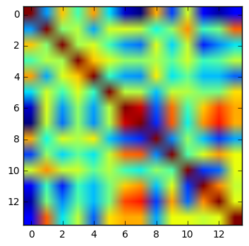

## Wine dataset
We will be looking at a dataset that consists of wine statistics by wine category.  

(1) Modify the following to see the head of the wine data file.  (You should specify the relative path of the data.)


```python
f = open("/Users/KathrynChiang/Downloads/wine.data.txt","r")
```


```python
!head wine.data.txt
```

    #The next 14 lines are the variable names, then the remaining lines are the data in csv
    Wine Class
    Alcohol
    Malic acid
    Ash
    Alcalinity of ash
    Magnesium
    Total phenols
    Flavanoids
    Nonflavanoid phenols


As you can see, the first several lines are the variable names and the remainder is comma separated lines of numbers.  

(2) Create a file object with open(), and then read in the lines in sequence.  Disregard the first line, read the next 14 in and save the variable names in a list, and save the rest in a list of lists of numbers (each line forms a list by splitting by commas).


```python
with open('/Users/KathrynChiang/Downloads/wine.data.txt','r') as f:
    count = 0
    varnames = []
    data = []
    _ = f.readline()
    for line in f:
        if count < 14:
            varnames.append(line.strip())
            count += 1
        else:
            data += [[float(a) for a in line.strip().split(',')]]
print varnames, data[0]
```

    ['Wine Class', 'Alcohol', 'Malic acid', 'Ash', 'Alcalinity of ash', 'Magnesium', 'Total phenols', 'Flavanoids', 'Nonflavanoid phenols', 'Proanthocyanins', 'Color intensity', 'Hue', 'OD280/OD315 of diluted wines', 'Proline'] [1.0, 14.23, 1.71, 2.43, 15.6, 127.0, 2.8, 3.06, 0.28, 2.29, 5.64, 1.04, 3.92, 1065.0]


(3) Import numpy and save the list of lists as an array object, where the entries are floats.


```python
import numpy as np
dataArray = np.array(data)
print dataArray.dtype
```

    float64


(4) Print the sample mean and standard deviations of each column (variable).


```python
mean = []
std = []
for column in range(len(dataArray.T)):
    mean.append(np.mean(dataArray.T[column]))
    std.append(np.std(dataArray.T[column]))
```

(5) Normalize the data matrix by subtracting each column mean and divide by the column standard deviation for each column.


```python
norm = []

for i in range(len(dataArray)):
    row = []
    for j in range(len(dataArray[0])):
        row.append((dataArray[i][j] - mean[j]) / std[j])
    norm.append(row)
```

(6) Save the number of rows of the matrix as n.


```python
n,p = dataArray.shape
print n
```

    178


(7) The correlation matrix of a normalized matrix X can be computed as $$\frac{1}{n-1}X^\top X$$  Compute this. 


```python
Xnorm = np.array(norm)
XnormT = Xnorm.T
Cov = np.dot(XnormT, Xnorm)/(n-1)
```

(8) Use the following code to print an image that corresponds to the correlation matrix.


```python
from matplotlib import pyplot as plt
plt.imshow(Cov)
plt.show()
```





The following computes F-scores for individual ANOVAs for each variable by class.  If you get finished early try to figure out what's going on.


```python
X = dataArray
N = np.array([(X[:,0] == i+1).sum() for i in range(3)])
V = np.array([X[X[:,0] == i+1,1:].var(axis=0) for i in range(3)])
M = np.array([X[X[:,0] == i+1,1:].mean(axis=0) for i in range(3)])
Bvar = (((M - X[:,1:].mean(axis=0))**2.).T * N).sum(axis=1) / 2
Wvar = (V.T * (N-1)).sum(axis=1) / (n - 3)
F = Bvar / Wvar
print F
```

    [ 137.3861116    37.58265615   13.5260966    36.35357397   12.62981408
       95.24380219  237.53617769   28.0471868    30.76266898  122.99581166
      102.9202907   192.99700461  211.40023981]


```python

```
