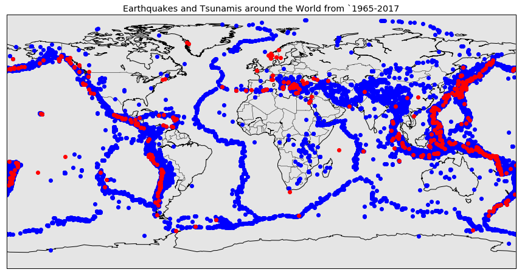
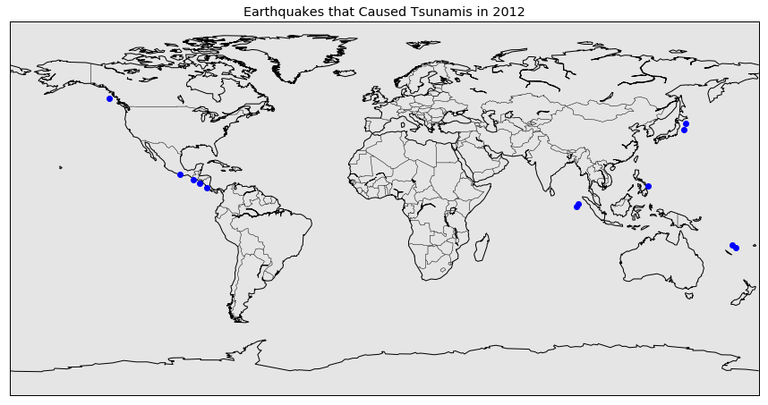
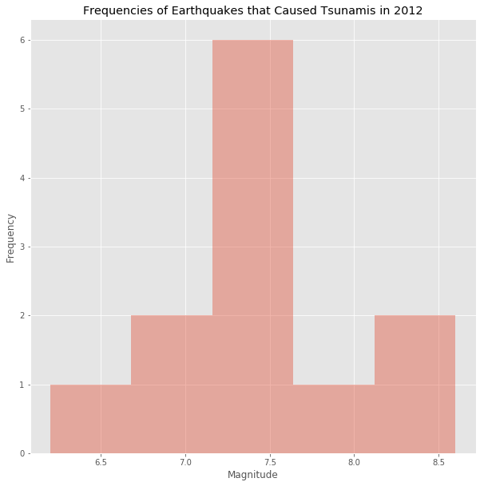
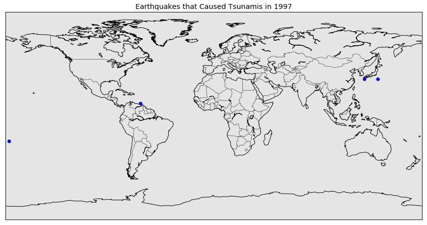
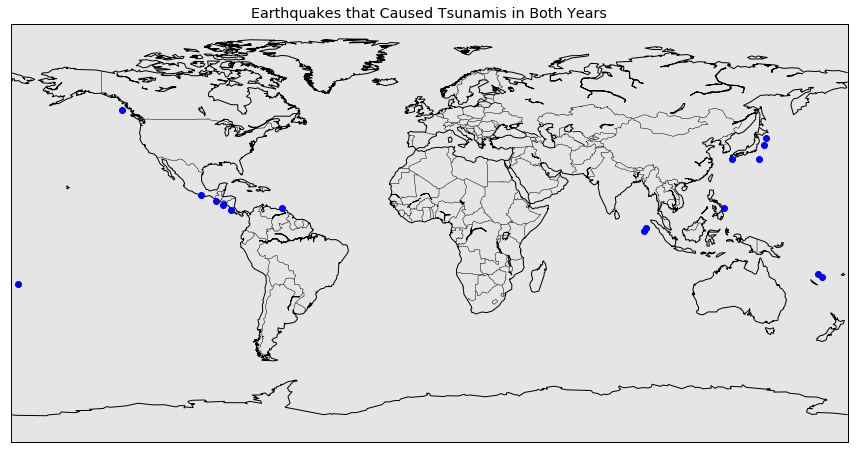
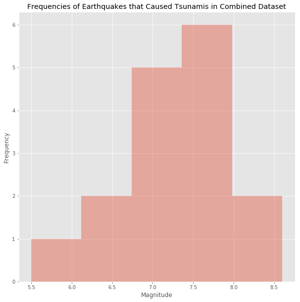

## The Relationship Between Earthquakes and Tsunamis

In this part of the project, I took a dataset of significant earthquakes from 1965-2012. The tsunami dataset contains a list of observations of tsunamis that have occured throughout history and comes from the NOAA website that contains many types of information related to tsunamis. Big earthquakes are said to cause tsunamis so I will be analyzing how earthquakes and tsunamis are related what how big of earthquakes usually cause tsunamis.


```python
import pandas as pd
import matplotlib
from matplotlib import pyplot as plt
import numpy as np
```


```python
plt.style.use('ggplot')
```


```python
# earthquakes dataframe
earthquakes = pd.read_csv('world_eq.csv')
earthquakes.head(10)
```


<div>
<table border="1" class="dataframe">
  <thead>
    <tr style="text-align: right;">
      <th></th>
      <th>Date</th>
      <th>Time</th>
      <th>Latitude</th>
      <th>Longitude</th>
      <th>Type</th>
      <th>Depth</th>
      <th>Depth Error</th>
      <th>Depth Seismic Stations</th>
      <th>Magnitude</th>
      <th>Magnitude Type</th>
      <th>...</th>
      <th>Magnitude Seismic Stations</th>
      <th>Azimuthal Gap</th>
      <th>Horizontal Distance</th>
      <th>Horizontal Error</th>
      <th>Root Mean Square</th>
      <th>ID</th>
      <th>Source</th>
      <th>Location Source</th>
      <th>Magnitude Source</th>
      <th>Status</th>
    </tr>
  </thead>
  <tbody>
    <tr>
      <th>0</th>
      <td>1/2/1965</td>
      <td>13:44:18</td>
      <td>19.246</td>
      <td>145.616</td>
      <td>Earthquake</td>
      <td>131.6</td>
      <td>NaN</td>
      <td>NaN</td>
      <td>6.0</td>
      <td>MW</td>
      <td>...</td>
      <td>NaN</td>
      <td>NaN</td>
      <td>NaN</td>
      <td>NaN</td>
      <td>NaN</td>
      <td>ISCGEM860706</td>
      <td>ISCGEM</td>
      <td>ISCGEM</td>
      <td>ISCGEM</td>
      <td>Automatic</td>
    </tr>
    <tr>
      <th>1</th>
      <td>1/4/1965</td>
      <td>11:29:49</td>
      <td>1.863</td>
      <td>127.352</td>
      <td>Earthquake</td>
      <td>80.0</td>
      <td>NaN</td>
      <td>NaN</td>
      <td>5.8</td>
      <td>MW</td>
      <td>...</td>
      <td>NaN</td>
      <td>NaN</td>
      <td>NaN</td>
      <td>NaN</td>
      <td>NaN</td>
      <td>ISCGEM860737</td>
      <td>ISCGEM</td>
      <td>ISCGEM</td>
      <td>ISCGEM</td>
      <td>Automatic</td>
    </tr>
    <tr>
      <th>2</th>
      <td>1/5/1965</td>
      <td>18:05:58</td>
      <td>-20.579</td>
      <td>-173.972</td>
      <td>Earthquake</td>
      <td>20.0</td>
      <td>NaN</td>
      <td>NaN</td>
      <td>6.2</td>
      <td>MW</td>
      <td>...</td>
      <td>NaN</td>
      <td>NaN</td>
      <td>NaN</td>
      <td>NaN</td>
      <td>NaN</td>
      <td>ISCGEM860762</td>
      <td>ISCGEM</td>
      <td>ISCGEM</td>
      <td>ISCGEM</td>
      <td>Automatic</td>
    </tr>
    <tr>
      <th>3</th>
      <td>1/8/1965</td>
      <td>18:49:43</td>
      <td>-59.076</td>
      <td>-23.557</td>
      <td>Earthquake</td>
      <td>15.0</td>
      <td>NaN</td>
      <td>NaN</td>
      <td>5.8</td>
      <td>MW</td>
      <td>...</td>
      <td>NaN</td>
      <td>NaN</td>
      <td>NaN</td>
      <td>NaN</td>
      <td>NaN</td>
      <td>ISCGEM860856</td>
      <td>ISCGEM</td>
      <td>ISCGEM</td>
      <td>ISCGEM</td>
      <td>Automatic</td>
    </tr>
    <tr>
      <th>4</th>
      <td>1/9/1965</td>
      <td>13:32:50</td>
      <td>11.938</td>
      <td>126.427</td>
      <td>Earthquake</td>
      <td>15.0</td>
      <td>NaN</td>
      <td>NaN</td>
      <td>5.8</td>
      <td>MW</td>
      <td>...</td>
      <td>NaN</td>
      <td>NaN</td>
      <td>NaN</td>
      <td>NaN</td>
      <td>NaN</td>
      <td>ISCGEM860890</td>
      <td>ISCGEM</td>
      <td>ISCGEM</td>
      <td>ISCGEM</td>
      <td>Automatic</td>
    </tr>
    <tr>
      <th>5</th>
      <td>1/10/1965</td>
      <td>13:36:32</td>
      <td>-13.405</td>
      <td>166.629</td>
      <td>Earthquake</td>
      <td>35.0</td>
      <td>NaN</td>
      <td>NaN</td>
      <td>6.7</td>
      <td>MW</td>
      <td>...</td>
      <td>NaN</td>
      <td>NaN</td>
      <td>NaN</td>
      <td>NaN</td>
      <td>NaN</td>
      <td>ISCGEM860922</td>
      <td>ISCGEM</td>
      <td>ISCGEM</td>
      <td>ISCGEM</td>
      <td>Automatic</td>
    </tr>
    <tr>
      <th>6</th>
      <td>1/12/1965</td>
      <td>13:32:25</td>
      <td>27.357</td>
      <td>87.867</td>
      <td>Earthquake</td>
      <td>20.0</td>
      <td>NaN</td>
      <td>NaN</td>
      <td>5.9</td>
      <td>MW</td>
      <td>...</td>
      <td>NaN</td>
      <td>NaN</td>
      <td>NaN</td>
      <td>NaN</td>
      <td>NaN</td>
      <td>ISCGEM861007</td>
      <td>ISCGEM</td>
      <td>ISCGEM</td>
      <td>ISCGEM</td>
      <td>Automatic</td>
    </tr>
    <tr>
      <th>7</th>
      <td>1/15/1965</td>
      <td>23:17:42</td>
      <td>-13.309</td>
      <td>166.212</td>
      <td>Earthquake</td>
      <td>35.0</td>
      <td>NaN</td>
      <td>NaN</td>
      <td>6.0</td>
      <td>MW</td>
      <td>...</td>
      <td>NaN</td>
      <td>NaN</td>
      <td>NaN</td>
      <td>NaN</td>
      <td>NaN</td>
      <td>ISCGEM861111</td>
      <td>ISCGEM</td>
      <td>ISCGEM</td>
      <td>ISCGEM</td>
      <td>Automatic</td>
    </tr>
    <tr>
      <th>8</th>
      <td>1/16/1965</td>
      <td>11:32:37</td>
      <td>-56.452</td>
      <td>-27.043</td>
      <td>Earthquake</td>
      <td>95.0</td>
      <td>NaN</td>
      <td>NaN</td>
      <td>6.0</td>
      <td>MW</td>
      <td>...</td>
      <td>NaN</td>
      <td>NaN</td>
      <td>NaN</td>
      <td>NaN</td>
      <td>NaN</td>
      <td>ISCGEMSUP861125</td>
      <td>ISCGEMSUP</td>
      <td>ISCGEM</td>
      <td>ISCGEM</td>
      <td>Automatic</td>
    </tr>
    <tr>
      <th>9</th>
      <td>1/17/1965</td>
      <td>10:43:17</td>
      <td>-24.563</td>
      <td>178.487</td>
      <td>Earthquake</td>
      <td>565.0</td>
      <td>NaN</td>
      <td>NaN</td>
      <td>5.8</td>
      <td>MW</td>
      <td>...</td>
      <td>NaN</td>
      <td>NaN</td>
      <td>NaN</td>
      <td>NaN</td>
      <td>NaN</td>
      <td>ISCGEM861148</td>
      <td>ISCGEM</td>
      <td>ISCGEM</td>
      <td>ISCGEM</td>
      <td>Automatic</td>
    </tr>
  </tbody>
</table>
<p>10 rows × 21 columns</p>
</div>


```python
len(earthquakes.index)
```


    23412


```python
earthquakes = earthquakes[["Date", "Time", "Latitude","Longitude","Magnitude", "Depth"]]
earthquakes.head()
```


<div>
<table border="1" class="dataframe">
  <thead>
    <tr style="text-align: right;">
      <th></th>
      <th>Date</th>
      <th>Time</th>
      <th>Latitude</th>
      <th>Longitude</th>
      <th>Magnitude</th>
      <th>Depth</th>
    </tr>
  </thead>
  <tbody>
    <tr>
      <th>0</th>
      <td>1/2/1965</td>
      <td>13:44:18</td>
      <td>19.246</td>
      <td>145.616</td>
      <td>6.0</td>
      <td>131.6</td>
    </tr>
    <tr>
      <th>1</th>
      <td>1/4/1965</td>
      <td>11:29:49</td>
      <td>1.863</td>
      <td>127.352</td>
      <td>5.8</td>
      <td>80.0</td>
    </tr>
    <tr>
      <th>2</th>
      <td>1/5/1965</td>
      <td>18:05:58</td>
      <td>-20.579</td>
      <td>-173.972</td>
      <td>6.2</td>
      <td>20.0</td>
    </tr>
    <tr>
      <th>3</th>
      <td>1/8/1965</td>
      <td>18:49:43</td>
      <td>-59.076</td>
      <td>-23.557</td>
      <td>5.8</td>
      <td>15.0</td>
    </tr>
    <tr>
      <th>4</th>
      <td>1/9/1965</td>
      <td>13:32:50</td>
      <td>11.938</td>
      <td>126.427</td>
      <td>5.8</td>
      <td>15.0</td>
    </tr>
  </tbody>
</table>
</div>


```python
# tsunamis dataframe
tsunamis = pd.read_excel('tsevent.xlsx')
tsunamis.head()
```


<div>
<table border="1" class="dataframe">
  <thead>
    <tr style="text-align: right;">
      <th></th>
      <th>ID</th>
      <th>YEAR</th>
      <th>MONTH</th>
      <th>DAY</th>
      <th>HOUR</th>
      <th>MINUTE</th>
      <th>SECOND</th>
      <th>EVENT_VALIDITY</th>
      <th>CAUSE_CODE</th>
      <th>FOCAL_DEPTH</th>
      <th>...</th>
      <th>TOTAL_MISSING</th>
      <th>TOTAL_MISSING_DESCRIPTION</th>
      <th>TOTAL_INJURIES</th>
      <th>TOTAL_INJURIES_DESCRIPTION</th>
      <th>TOTAL_DAMAGE_MILLIONS_DOLLARS</th>
      <th>TOTAL_DAMAGE_DESCRIPTION</th>
      <th>TOTAL_HOUSES_DESTROYED</th>
      <th>TOTAL_HOUSES_DESTROYED_DESCRIPTION</th>
      <th>TOTAL_HOUSES_DAMAGED</th>
      <th>TOTAL_HOUSES_DAMAGED_DESCRIPTION</th>
    </tr>
  </thead>
  <tbody>
    <tr>
      <th>0</th>
      <td>1</td>
      <td>-2000</td>
      <td>NaN</td>
      <td>NaN</td>
      <td>NaN</td>
      <td>NaN</td>
      <td>NaN</td>
      <td>1.0</td>
      <td>1.0</td>
      <td>NaN</td>
      <td>...</td>
      <td>NaN</td>
      <td>NaN</td>
      <td>NaN</td>
      <td>NaN</td>
      <td>NaN</td>
      <td>4.0</td>
      <td>NaN</td>
      <td>NaN</td>
      <td>NaN</td>
      <td>NaN</td>
    </tr>
    <tr>
      <th>1</th>
      <td>3</td>
      <td>-1610</td>
      <td>NaN</td>
      <td>NaN</td>
      <td>NaN</td>
      <td>NaN</td>
      <td>NaN</td>
      <td>4.0</td>
      <td>6.0</td>
      <td>NaN</td>
      <td>...</td>
      <td>NaN</td>
      <td>NaN</td>
      <td>NaN</td>
      <td>NaN</td>
      <td>NaN</td>
      <td>3.0</td>
      <td>NaN</td>
      <td>NaN</td>
      <td>NaN</td>
      <td>NaN</td>
    </tr>
    <tr>
      <th>2</th>
      <td>4</td>
      <td>-1365</td>
      <td>NaN</td>
      <td>NaN</td>
      <td>NaN</td>
      <td>NaN</td>
      <td>NaN</td>
      <td>1.0</td>
      <td>1.0</td>
      <td>NaN</td>
      <td>...</td>
      <td>NaN</td>
      <td>NaN</td>
      <td>NaN</td>
      <td>NaN</td>
      <td>NaN</td>
      <td>3.0</td>
      <td>NaN</td>
      <td>NaN</td>
      <td>NaN</td>
      <td>NaN</td>
    </tr>
    <tr>
      <th>3</th>
      <td>5</td>
      <td>-1300</td>
      <td>NaN</td>
      <td>NaN</td>
      <td>NaN</td>
      <td>NaN</td>
      <td>NaN</td>
      <td>2.0</td>
      <td>0.0</td>
      <td>NaN</td>
      <td>...</td>
      <td>NaN</td>
      <td>NaN</td>
      <td>NaN</td>
      <td>NaN</td>
      <td>NaN</td>
      <td>NaN</td>
      <td>NaN</td>
      <td>NaN</td>
      <td>NaN</td>
      <td>NaN</td>
    </tr>
    <tr>
      <th>4</th>
      <td>6</td>
      <td>-760</td>
      <td>NaN</td>
      <td>NaN</td>
      <td>NaN</td>
      <td>NaN</td>
      <td>NaN</td>
      <td>2.0</td>
      <td>0.0</td>
      <td>NaN</td>
      <td>...</td>
      <td>NaN</td>
      <td>NaN</td>
      <td>NaN</td>
      <td>NaN</td>
      <td>NaN</td>
      <td>NaN</td>
      <td>NaN</td>
      <td>NaN</td>
      <td>NaN</td>
      <td>NaN</td>
    </tr>
  </tbody>
</table>
<p>5 rows × 46 columns</p>
</div>


```python
from mpl_toolkits.basemap import Basemap
from matplotlib.colors import rgb2hex
from matplotlib.patches import Polygon
```


```python
for i in range(0, len(tsunamis.columns.values)):
    tsunamis.columns.values[i] = str(tsunamis.columns.values[i])
```


```python
# delete unnecessary columns
tsunamis.drop(tsunamis.columns[[range(16,46)]], inplace = True, axis = 1)
tsunamis = tsunamis[["ID", "YEAR", "MONTH", "DAY", "HOUR", "MINUTE", "COUNTRY", "STATE", "LOCATION_NAME", "LATITUDE", "LONGITUDE"]]
tsunamis.head()
```


<div>
<table border="1" class="dataframe">
  <thead>
    <tr style="text-align: right;">
      <th></th>
      <th>ID</th>
      <th>YEAR</th>
      <th>MONTH</th>
      <th>DAY</th>
      <th>HOUR</th>
      <th>MINUTE</th>
      <th>COUNTRY</th>
      <th>STATE</th>
      <th>LOCATION_NAME</th>
      <th>LATITUDE</th>
      <th>LONGITUDE</th>
    </tr>
  </thead>
  <tbody>
    <tr>
      <th>0</th>
      <td>1</td>
      <td>-2000</td>
      <td>NaN</td>
      <td>NaN</td>
      <td>NaN</td>
      <td>NaN</td>
      <td>SYRIA</td>
      <td>NaN</td>
      <td>SYRIAN COASTS</td>
      <td>35.683</td>
      <td>35.80</td>
    </tr>
    <tr>
      <th>1</th>
      <td>3</td>
      <td>-1610</td>
      <td>NaN</td>
      <td>NaN</td>
      <td>NaN</td>
      <td>NaN</td>
      <td>GREECE</td>
      <td>NaN</td>
      <td>THERA ISLAND (SANTORINI)</td>
      <td>36.400</td>
      <td>25.40</td>
    </tr>
    <tr>
      <th>2</th>
      <td>4</td>
      <td>-1365</td>
      <td>NaN</td>
      <td>NaN</td>
      <td>NaN</td>
      <td>NaN</td>
      <td>SYRIA</td>
      <td>NaN</td>
      <td>SYRIAN COASTS</td>
      <td>35.683</td>
      <td>35.80</td>
    </tr>
    <tr>
      <th>3</th>
      <td>5</td>
      <td>-1300</td>
      <td>NaN</td>
      <td>NaN</td>
      <td>NaN</td>
      <td>NaN</td>
      <td>TURKEY</td>
      <td>NaN</td>
      <td>IONIAN COASTS, TROAD</td>
      <td>39.960</td>
      <td>26.24</td>
    </tr>
    <tr>
      <th>4</th>
      <td>6</td>
      <td>-760</td>
      <td>NaN</td>
      <td>NaN</td>
      <td>NaN</td>
      <td>NaN</td>
      <td>ISRAEL</td>
      <td>NaN</td>
      <td>ISRAEL AND LEBANON COASTS</td>
      <td>NaN</td>
      <td>NaN</td>
    </tr>
  </tbody>
</table>
</div>


I felt that some of these variables in the tsunami datasets, with most of them being the number of destructions, injured, and damages were unnecessary in this part of the project so I deleted those variables from the dataset.


```python
# Drop N/A lon/lat values for tsunami
# I filtered with longitude because if longitude has N/A, corresponding latitude also has it
tsu = tsunamis.loc[np.isnan(tsunamis['LONGITUDE']) == False]
tsu.head()
```


<div>
<table border="1" class="dataframe">
  <thead>
    <tr style="text-align: right;">
      <th></th>
      <th>ID</th>
      <th>YEAR</th>
      <th>MONTH</th>
      <th>DAY</th>
      <th>HOUR</th>
      <th>MINUTE</th>
      <th>COUNTRY</th>
      <th>STATE</th>
      <th>LOCATION_NAME</th>
      <th>LATITUDE</th>
      <th>LONGITUDE</th>
    </tr>
  </thead>
  <tbody>
    <tr>
      <th>0</th>
      <td>1</td>
      <td>-2000</td>
      <td>NaN</td>
      <td>NaN</td>
      <td>NaN</td>
      <td>NaN</td>
      <td>SYRIA</td>
      <td>NaN</td>
      <td>SYRIAN COASTS</td>
      <td>35.683</td>
      <td>35.80</td>
    </tr>
    <tr>
      <th>1</th>
      <td>3</td>
      <td>-1610</td>
      <td>NaN</td>
      <td>NaN</td>
      <td>NaN</td>
      <td>NaN</td>
      <td>GREECE</td>
      <td>NaN</td>
      <td>THERA ISLAND (SANTORINI)</td>
      <td>36.400</td>
      <td>25.40</td>
    </tr>
    <tr>
      <th>2</th>
      <td>4</td>
      <td>-1365</td>
      <td>NaN</td>
      <td>NaN</td>
      <td>NaN</td>
      <td>NaN</td>
      <td>SYRIA</td>
      <td>NaN</td>
      <td>SYRIAN COASTS</td>
      <td>35.683</td>
      <td>35.80</td>
    </tr>
    <tr>
      <th>3</th>
      <td>5</td>
      <td>-1300</td>
      <td>NaN</td>
      <td>NaN</td>
      <td>NaN</td>
      <td>NaN</td>
      <td>TURKEY</td>
      <td>NaN</td>
      <td>IONIAN COASTS, TROAD</td>
      <td>39.960</td>
      <td>26.24</td>
    </tr>
    <tr>
      <th>5</th>
      <td>7</td>
      <td>-590</td>
      <td>NaN</td>
      <td>NaN</td>
      <td>NaN</td>
      <td>NaN</td>
      <td>LEBANON</td>
      <td>NaN</td>
      <td>LEBANON COASTS</td>
      <td>33.270</td>
      <td>35.22</td>
    </tr>
  </tbody>
</table>
</div>


I noticed that my tsunami dataset had some N/A values for some observations so I dropped those observations or I would not have been able to plot those observations on a new map.


```python
recenttsu = tsu.loc[tsunamis['YEAR'] > 1964]
recenttsu.head()
```


<div>
<table border="1" class="dataframe">
  <thead>
    <tr style="text-align: right;">
      <th></th>
      <th>ID</th>
      <th>YEAR</th>
      <th>MONTH</th>
      <th>DAY</th>
      <th>HOUR</th>
      <th>MINUTE</th>
      <th>COUNTRY</th>
      <th>STATE</th>
      <th>LOCATION_NAME</th>
      <th>LATITUDE</th>
      <th>LONGITUDE</th>
    </tr>
  </thead>
  <tbody>
    <tr>
      <th>2026</th>
      <td>1963</td>
      <td>1965</td>
      <td>1.0</td>
      <td>24.0</td>
      <td>0.0</td>
      <td>11.0</td>
      <td>INDONESIA</td>
      <td>NaN</td>
      <td>SANANA ISLAND</td>
      <td>-2.400</td>
      <td>126.100</td>
    </tr>
    <tr>
      <th>2027</th>
      <td>1964</td>
      <td>1965</td>
      <td>2.0</td>
      <td>4.0</td>
      <td>5.0</td>
      <td>1.0</td>
      <td>USA</td>
      <td>AK</td>
      <td>RAT ISLANDS, ALEUTIAN ISLANDS, AK</td>
      <td>51.290</td>
      <td>178.550</td>
    </tr>
    <tr>
      <th>2028</th>
      <td>5470</td>
      <td>1965</td>
      <td>2.0</td>
      <td>19.0</td>
      <td>NaN</td>
      <td>NaN</td>
      <td>CHILE</td>
      <td>NaN</td>
      <td>SOUTHERN CHILE</td>
      <td>-41.755</td>
      <td>-72.396</td>
    </tr>
    <tr>
      <th>2029</th>
      <td>1965</td>
      <td>1965</td>
      <td>2.0</td>
      <td>23.0</td>
      <td>22.0</td>
      <td>11.0</td>
      <td>CHILE</td>
      <td>NaN</td>
      <td>NORTHERN CHILE</td>
      <td>-25.670</td>
      <td>-70.630</td>
    </tr>
    <tr>
      <th>2030</th>
      <td>3042</td>
      <td>1965</td>
      <td>3.0</td>
      <td>9.0</td>
      <td>17.0</td>
      <td>57.0</td>
      <td>GREECE</td>
      <td>NaN</td>
      <td>AEGEAN SEA</td>
      <td>39.400</td>
      <td>24.000</td>
    </tr>
  </tbody>
</table>
</div>


```python
len(recenttsu.index)
```


    546


The dataset above is a list of tsunamis that happened from 1965-2017 which corresponds with the timeframe of the earthquakes dataset.

## What is the geographical distribution of the earthquakes and tsunamis list and how much do they overlap?


```python
# draw world map

plt.figure(figsize=(15,10))
displaymap = Basemap(llcrnrlon=-180,llcrnrlat=-90,urcrnrlon=180,urcrnrlat=90)
```


```python
displaymap.drawmapboundary()
displaymap.drawcountries()
displaymap.drawcoastlines()
```

    C:\Users\Apus\Anaconda2\lib\site-packages\mpl_toolkits\basemap\__init__.py:1623: MatplotlibDeprecationWarning: The get_axis_bgcolor function was deprecated in version 2.0. Use get_facecolor instead.
      fill_color = ax.get_axis_bgcolor()


    <matplotlib.collections.LineCollection at 0xc4725c0>


```python
# Convert longitudes and latitudes to list of floats
longitude = earthquakes[['Longitude']].values.tolist()
for i in range(0, len(longitude)):
    longitude[i] = float(longitude[i][0])
latitude = earthquakes[['Latitude']].values.tolist()
for i in range(0, len(latitude)):
    latitude[i] = float(latitude[i][0])
tlongitude = recenttsu[[u'LONGITUDE']].values.tolist()
for i in range(0, len(tlongitude)):
    tlongitude[i] = float(tlongitude[i][0])
tlatitude = recenttsu[[u'LATITUDE']].values.tolist()
for i in range(0, len(tlatitude)):
    tlatitude[i] = float(tlatitude[i][0])
```


```python
lons,lats = displaymap(longitude, latitude)
tlons, tlats = displaymap(tlongitude, tlatitude)
displaymap.plot(lons, lats, 'bo', color = "blue")
displaymap.plot(tlons, tlats, 'bo', color = "red")
```

    C:\Users\Apus\Anaconda2\lib\site-packages\mpl_toolkits\basemap\__init__.py:3260: MatplotlibDeprecationWarning: The ishold function was deprecated in version 2.0.
      b = ax.ishold()
    C:\Users\Apus\Anaconda2\lib\site-packages\mpl_toolkits\basemap\__init__.py:3269: MatplotlibDeprecationWarning: axes.hold is deprecated.
        See the API Changes document (http://matplotlib.org/api/api_changes.html)
        for more details.
      ax.hold(b)


    [<matplotlib.lines.Line2D at 0xcbd1c50>]


```python
plt.title("Earthquakes and Tsunamis around the World from `1965-2017")
plt.show()
```





First, I converted all the observations for longitude and latitude in both sets from strings to floats. Then I plotted a map and all the known points for the earthquakes dataset and all the known points for the tsunami datasets. It seems that a lot of the points both overlap somewhere in the North American region and in the East Asian region and in the area known as the Ring of Fire where a large number of earthquakes and volcanic activity occur. It also looks like more tsunamis have occured in the Europe region rather than earthquakes.


```python
dates = earthquakes[['Date']].values.tolist()
years = []
months = []
days = []
for i in range(0, len(dates)):
    dates[i] = dates[i][0].split("/")
    try:
        years.append(dates[i][2])
    except IndexError:
        years.append('NaN')
    try:
        months.append(dates[i][0])
    except IndexError:
        months.append('NaN')
    try:
        days.append(dates[i][1])
    except IndexError:
        days.append('NaN')
```


```python
idlist = []
for i in range(0, len(earthquakes.index)):
    idlist.append(i)
```


```python
earthquakes['Year'] = years
earthquakes['Month'] = months
earthquakes['Days'] = days
earthquakes['ID'] = idlist
```


```python
earthquakes.head()
```


<div>
<table border="1" class="dataframe">
  <thead>
    <tr style="text-align: right;">
      <th></th>
      <th>Date</th>
      <th>Time</th>
      <th>Latitude</th>
      <th>Longitude</th>
      <th>Magnitude</th>
      <th>Depth</th>
      <th>Year</th>
      <th>Month</th>
      <th>Days</th>
      <th>ID</th>
    </tr>
  </thead>
  <tbody>
    <tr>
      <th>0</th>
      <td>1/2/1965</td>
      <td>13:44:18</td>
      <td>19.246</td>
      <td>145.616</td>
      <td>6.0</td>
      <td>131.6</td>
      <td>1965</td>
      <td>1</td>
      <td>2</td>
      <td>0</td>
    </tr>
    <tr>
      <th>1</th>
      <td>1/4/1965</td>
      <td>11:29:49</td>
      <td>1.863</td>
      <td>127.352</td>
      <td>5.8</td>
      <td>80.0</td>
      <td>1965</td>
      <td>1</td>
      <td>4</td>
      <td>1</td>
    </tr>
    <tr>
      <th>2</th>
      <td>1/5/1965</td>
      <td>18:05:58</td>
      <td>-20.579</td>
      <td>-173.972</td>
      <td>6.2</td>
      <td>20.0</td>
      <td>1965</td>
      <td>1</td>
      <td>5</td>
      <td>2</td>
    </tr>
    <tr>
      <th>3</th>
      <td>1/8/1965</td>
      <td>18:49:43</td>
      <td>-59.076</td>
      <td>-23.557</td>
      <td>5.8</td>
      <td>15.0</td>
      <td>1965</td>
      <td>1</td>
      <td>8</td>
      <td>3</td>
    </tr>
    <tr>
      <th>4</th>
      <td>1/9/1965</td>
      <td>13:32:50</td>
      <td>11.938</td>
      <td>126.427</td>
      <td>5.8</td>
      <td>15.0</td>
      <td>1965</td>
      <td>1</td>
      <td>9</td>
      <td>4</td>
    </tr>
  </tbody>
</table>
</div>


I split the dates into days, months, and years and added those rows to the dataset so I can analyze the dataset more flexibly. I also added IDs to each observation in order to remember specific ones.

## How often do earthquakes cause tsunamis? How much of the tsunamis in the dataset are caused by earthquakes?

I am interested in seeing how many earthquakes cause tsunamis in each year and their magnitude so I will pick two random years and analyze the earthquakes and tsunamis in those years.


```python
float(len(recenttsu.index))/float(len(earthquakes.index))
```


    0.023321373654536137


Earthquakes are sometimes said to cause tsunamis and based on this, about 2.3% of earthquakes cause tsunamis.


```python
eq2012 = earthquakes.loc[(earthquakes['Year'] == '2012')]
tsu2012 = tsu.loc[tsu[u'YEAR'] == 2012]
```


```python
tsu2012
```


<div>
<table border="1" class="dataframe">
  <thead>
    <tr style="text-align: right;">
      <th></th>
      <th>ID</th>
      <th>YEAR</th>
      <th>MONTH</th>
      <th>DAY</th>
      <th>HOUR</th>
      <th>MINUTE</th>
      <th>COUNTRY</th>
      <th>STATE</th>
      <th>LOCATION_NAME</th>
      <th>LATITUDE</th>
      <th>LONGITUDE</th>
    </tr>
  </thead>
  <tbody>
    <tr>
      <th>2515</th>
      <td>5442</td>
      <td>2012</td>
      <td>2.0</td>
      <td>2.0</td>
      <td>13.0</td>
      <td>34.0</td>
      <td>VANUATU</td>
      <td>NaN</td>
      <td>VANUATU ISLANDS</td>
      <td>-17.827</td>
      <td>167.133</td>
    </tr>
    <tr>
      <th>2516</th>
      <td>5446</td>
      <td>2012</td>
      <td>3.0</td>
      <td>14.0</td>
      <td>9.0</td>
      <td>8.0</td>
      <td>JAPAN</td>
      <td>NaN</td>
      <td>HOKKAIDO ISLAND</td>
      <td>40.887</td>
      <td>144.944</td>
    </tr>
    <tr>
      <th>2517</th>
      <td>5447</td>
      <td>2012</td>
      <td>3.0</td>
      <td>20.0</td>
      <td>18.0</td>
      <td>2.0</td>
      <td>MEXICO</td>
      <td>NaN</td>
      <td>S. MEXICO</td>
      <td>16.493</td>
      <td>-98.231</td>
    </tr>
    <tr>
      <th>2518</th>
      <td>5449</td>
      <td>2012</td>
      <td>4.0</td>
      <td>11.0</td>
      <td>8.0</td>
      <td>38.0</td>
      <td>INDONESIA</td>
      <td>NaN</td>
      <td>OFF W. COAST OF N SUMATRA</td>
      <td>2.327</td>
      <td>93.063</td>
    </tr>
    <tr>
      <th>2519</th>
      <td>5450</td>
      <td>2012</td>
      <td>4.0</td>
      <td>11.0</td>
      <td>10.0</td>
      <td>43.0</td>
      <td>INDONESIA</td>
      <td>NaN</td>
      <td>OFF W. COAST OF N SUMATRA</td>
      <td>0.802</td>
      <td>92.463</td>
    </tr>
    <tr>
      <th>2520</th>
      <td>5451</td>
      <td>2012</td>
      <td>4.0</td>
      <td>14.0</td>
      <td>22.0</td>
      <td>5.0</td>
      <td>VANUATU</td>
      <td>NaN</td>
      <td>VANUATU ISLANDS</td>
      <td>-18.972</td>
      <td>168.741</td>
    </tr>
    <tr>
      <th>2521</th>
      <td>5460</td>
      <td>2012</td>
      <td>7.0</td>
      <td>15.0</td>
      <td>NaN</td>
      <td>NaN</td>
      <td>GREENLAND</td>
      <td>NaN</td>
      <td>ILULISSAT ICEFJORD</td>
      <td>69.200</td>
      <td>-51.300</td>
    </tr>
    <tr>
      <th>2522</th>
      <td>5462</td>
      <td>2012</td>
      <td>8.0</td>
      <td>27.0</td>
      <td>4.0</td>
      <td>37.0</td>
      <td>NICARAGUA</td>
      <td>NaN</td>
      <td>OFF THE COAST</td>
      <td>12.139</td>
      <td>-88.590</td>
    </tr>
    <tr>
      <th>2523</th>
      <td>5463</td>
      <td>2012</td>
      <td>8.0</td>
      <td>31.0</td>
      <td>12.0</td>
      <td>47.0</td>
      <td>PHILIPPINES</td>
      <td>NaN</td>
      <td>PHILIPPINE ISLANDS</td>
      <td>10.811</td>
      <td>126.638</td>
    </tr>
    <tr>
      <th>2524</th>
      <td>5464</td>
      <td>2012</td>
      <td>9.0</td>
      <td>5.0</td>
      <td>14.0</td>
      <td>42.0</td>
      <td>COSTA RICA</td>
      <td>NaN</td>
      <td>COSTA RICA</td>
      <td>10.085</td>
      <td>-85.315</td>
    </tr>
    <tr>
      <th>2525</th>
      <td>5467</td>
      <td>2012</td>
      <td>10.0</td>
      <td>28.0</td>
      <td>3.0</td>
      <td>4.0</td>
      <td>CANADA</td>
      <td>BC</td>
      <td>BRITISH COLUMBIA</td>
      <td>52.788</td>
      <td>-132.101</td>
    </tr>
    <tr>
      <th>2526</th>
      <td>5468</td>
      <td>2012</td>
      <td>11.0</td>
      <td>7.0</td>
      <td>16.0</td>
      <td>35.0</td>
      <td>GUATEMALA</td>
      <td>NaN</td>
      <td>GUATEMALA</td>
      <td>13.988</td>
      <td>-91.895</td>
    </tr>
    <tr>
      <th>2527</th>
      <td>5469</td>
      <td>2012</td>
      <td>12.0</td>
      <td>7.0</td>
      <td>8.0</td>
      <td>18.0</td>
      <td>JAPAN</td>
      <td>NaN</td>
      <td>OFF EAST COAST OF HONSHU ISLAND</td>
      <td>37.890</td>
      <td>143.949</td>
    </tr>
    <tr>
      <th>2528</th>
      <td>5471</td>
      <td>2012</td>
      <td>12.0</td>
      <td>28.0</td>
      <td>NaN</td>
      <td>NaN</td>
      <td>CHINA</td>
      <td>NaN</td>
      <td>ZHAOJUN BRIDGE, HUBEI PROVINCE</td>
      <td>31.256</td>
      <td>110.733</td>
    </tr>
  </tbody>
</table>
</div>


```python
print len(tsu2012), len(eq2012)
```

    14 445


In the year 2012, it looks like there is 1 tsunami that occured in February, 2 in March, 3 in April, 1 in July, 2 in August, 1 in September, 1 in October, 1 in Novemer, and 2 in December with a total of 14 tsunamis. There are 445 earthquakes total in the year 2012.


```python
tsu2012.loc[tsu2012[u'MONTH'] == 2]
```


<div>
<table border="1" class="dataframe">
  <thead>
    <tr style="text-align: right;">
      <th></th>
      <th>ID</th>
      <th>YEAR</th>
      <th>MONTH</th>
      <th>DAY</th>
      <th>HOUR</th>
      <th>MINUTE</th>
      <th>COUNTRY</th>
      <th>STATE</th>
      <th>LOCATION_NAME</th>
      <th>LATITUDE</th>
      <th>LONGITUDE</th>
    </tr>
  </thead>
  <tbody>
    <tr>
      <th>2515</th>
      <td>5442</td>
      <td>2012</td>
      <td>2.0</td>
      <td>2.0</td>
      <td>13.0</td>
      <td>34.0</td>
      <td>VANUATU</td>
      <td>NaN</td>
      <td>VANUATU ISLANDS</td>
      <td>-17.827</td>
      <td>167.133</td>
    </tr>
  </tbody>
</table>
</div>


```python
eq2012.loc[(eq2012['Month'] == '2') & (eq2012['Days'] == '2')]
```


<div>
<table border="1" class="dataframe">
  <thead>
    <tr style="text-align: right;">
      <th></th>
      <th>Date</th>
      <th>Time</th>
      <th>Latitude</th>
      <th>Longitude</th>
      <th>Magnitude</th>
      <th>Depth</th>
      <th>Year</th>
      <th>Month</th>
      <th>Days</th>
      <th>ID</th>
    </tr>
  </thead>
  <tbody>
    <tr>
      <th>21142</th>
      <td>2/2/2012</td>
      <td>6:46:30</td>
      <td>-6.563</td>
      <td>149.774</td>
      <td>5.6</td>
      <td>51.3</td>
      <td>2012</td>
      <td>2</td>
      <td>2</td>
      <td>21142</td>
    </tr>
    <tr>
      <th>21143</th>
      <td>2/2/2012</td>
      <td>9:32:17</td>
      <td>-6.586</td>
      <td>149.718</td>
      <td>5.6</td>
      <td>38.6</td>
      <td>2012</td>
      <td>2</td>
      <td>2</td>
      <td>21143</td>
    </tr>
    <tr>
      <th>21144</th>
      <td>2/2/2012</td>
      <td>13:34:41</td>
      <td>-17.827</td>
      <td>167.133</td>
      <td>7.1</td>
      <td>23.0</td>
      <td>2012</td>
      <td>2</td>
      <td>2</td>
      <td>21144</td>
    </tr>
    <tr>
      <th>21145</th>
      <td>2/2/2012</td>
      <td>17:27:07</td>
      <td>-17.954</td>
      <td>167.179</td>
      <td>5.5</td>
      <td>20.6</td>
      <td>2012</td>
      <td>2</td>
      <td>2</td>
      <td>21145</td>
    </tr>
  </tbody>
</table>
</div>


I will look at the time, longitude, and latitude of the observations in the earthquakes and if any matches the tsunami values, then it is assumed that that specific earthquake caused the tsunami. The earthquake observation that matches this tsunami observation is the third observation in the earthquakes that happened in February 2012.


```python
earthquakes.loc[earthquakes['ID'] == 21144]
```


<div>
<table border="1" class="dataframe">
  <thead>
    <tr style="text-align: right;">
      <th></th>
      <th>Date</th>
      <th>Time</th>
      <th>Latitude</th>
      <th>Longitude</th>
      <th>Magnitude</th>
      <th>Depth</th>
      <th>Year</th>
      <th>Month</th>
      <th>Days</th>
      <th>ID</th>
    </tr>
  </thead>
  <tbody>
    <tr>
      <th>21144</th>
      <td>2/2/2012</td>
      <td>13:34:41</td>
      <td>-17.827</td>
      <td>167.133</td>
      <td>7.1</td>
      <td>23.0</td>
      <td>2012</td>
      <td>2</td>
      <td>2</td>
      <td>21144</td>
    </tr>
  </tbody>
</table>
</div>


Now I will do the same for March and the rest of the months


```python
tsu2012.loc[tsu2012[u'MONTH'] == 3]
```


<div>
<table border="1" class="dataframe">
  <thead>
    <tr style="text-align: right;">
      <th></th>
      <th>ID</th>
      <th>YEAR</th>
      <th>MONTH</th>
      <th>DAY</th>
      <th>HOUR</th>
      <th>MINUTE</th>
      <th>COUNTRY</th>
      <th>STATE</th>
      <th>LOCATION_NAME</th>
      <th>LATITUDE</th>
      <th>LONGITUDE</th>
    </tr>
  </thead>
  <tbody>
    <tr>
      <th>2516</th>
      <td>5446</td>
      <td>2012</td>
      <td>3.0</td>
      <td>14.0</td>
      <td>9.0</td>
      <td>8.0</td>
      <td>JAPAN</td>
      <td>NaN</td>
      <td>HOKKAIDO ISLAND</td>
      <td>40.887</td>
      <td>144.944</td>
    </tr>
    <tr>
      <th>2517</th>
      <td>5447</td>
      <td>2012</td>
      <td>3.0</td>
      <td>20.0</td>
      <td>18.0</td>
      <td>2.0</td>
      <td>MEXICO</td>
      <td>NaN</td>
      <td>S. MEXICO</td>
      <td>16.493</td>
      <td>-98.231</td>
    </tr>
  </tbody>
</table>
</div>


```python
eq2012.loc[(eq2012['Month'] == '3') & ((eq2012['Days'] == '14') | (eq2012['Days'] == '20'))]
```


<div>
<table border="1" class="dataframe">
  <thead>
    <tr style="text-align: right;">
      <th></th>
      <th>Date</th>
      <th>Time</th>
      <th>Latitude</th>
      <th>Longitude</th>
      <th>Magnitude</th>
      <th>Depth</th>
      <th>Year</th>
      <th>Month</th>
      <th>Days</th>
      <th>ID</th>
    </tr>
  </thead>
  <tbody>
    <tr>
      <th>21192</th>
      <td>3/14/2012</td>
      <td>9:08:35</td>
      <td>40.887</td>
      <td>144.944</td>
      <td>6.9</td>
      <td>12.0</td>
      <td>2012</td>
      <td>3</td>
      <td>14</td>
      <td>21192</td>
    </tr>
    <tr>
      <th>21193</th>
      <td>3/14/2012</td>
      <td>10:49:25</td>
      <td>40.781</td>
      <td>144.761</td>
      <td>6.1</td>
      <td>10.0</td>
      <td>2012</td>
      <td>3</td>
      <td>14</td>
      <td>21193</td>
    </tr>
    <tr>
      <th>21194</th>
      <td>3/14/2012</td>
      <td>10:57:40</td>
      <td>40.755</td>
      <td>144.806</td>
      <td>5.6</td>
      <td>12.0</td>
      <td>2012</td>
      <td>3</td>
      <td>14</td>
      <td>21194</td>
    </tr>
    <tr>
      <th>21195</th>
      <td>3/14/2012</td>
      <td>12:05:05</td>
      <td>35.687</td>
      <td>140.695</td>
      <td>6.0</td>
      <td>10.0</td>
      <td>2012</td>
      <td>3</td>
      <td>14</td>
      <td>21195</td>
    </tr>
    <tr>
      <th>21196</th>
      <td>3/14/2012</td>
      <td>21:13:08</td>
      <td>-5.595</td>
      <td>151.042</td>
      <td>6.2</td>
      <td>28.0</td>
      <td>2012</td>
      <td>3</td>
      <td>14</td>
      <td>21196</td>
    </tr>
    <tr>
      <th>21202</th>
      <td>3/20/2012</td>
      <td>17:56:19</td>
      <td>-3.812</td>
      <td>140.266</td>
      <td>6.1</td>
      <td>66.0</td>
      <td>2012</td>
      <td>3</td>
      <td>20</td>
      <td>21202</td>
    </tr>
    <tr>
      <th>21203</th>
      <td>3/20/2012</td>
      <td>18:02:47</td>
      <td>16.493</td>
      <td>-98.231</td>
      <td>7.4</td>
      <td>20.0</td>
      <td>2012</td>
      <td>3</td>
      <td>20</td>
      <td>21203</td>
    </tr>
  </tbody>
</table>
</div>


```python
earthquakes.loc[(earthquakes['ID'] == 21192) | (earthquakes['ID'] == 21203)]
```


<div>
<table border="1" class="dataframe">
  <thead>
    <tr style="text-align: right;">
      <th></th>
      <th>Date</th>
      <th>Time</th>
      <th>Latitude</th>
      <th>Longitude</th>
      <th>Magnitude</th>
      <th>Depth</th>
      <th>Year</th>
      <th>Month</th>
      <th>Days</th>
      <th>ID</th>
    </tr>
  </thead>
  <tbody>
    <tr>
      <th>21192</th>
      <td>3/14/2012</td>
      <td>9:08:35</td>
      <td>40.887</td>
      <td>144.944</td>
      <td>6.9</td>
      <td>12.0</td>
      <td>2012</td>
      <td>3</td>
      <td>14</td>
      <td>21192</td>
    </tr>
    <tr>
      <th>21203</th>
      <td>3/20/2012</td>
      <td>18:02:47</td>
      <td>16.493</td>
      <td>-98.231</td>
      <td>7.4</td>
      <td>20.0</td>
      <td>2012</td>
      <td>3</td>
      <td>20</td>
      <td>21203</td>
    </tr>
  </tbody>
</table>
</div>


```python
tsu2012.loc[tsu2012[u'MONTH'] == 4]
```


<div>
<table border="1" class="dataframe">
  <thead>
    <tr style="text-align: right;">
      <th></th>
      <th>ID</th>
      <th>YEAR</th>
      <th>MONTH</th>
      <th>DAY</th>
      <th>HOUR</th>
      <th>MINUTE</th>
      <th>COUNTRY</th>
      <th>STATE</th>
      <th>LOCATION_NAME</th>
      <th>LATITUDE</th>
      <th>LONGITUDE</th>
    </tr>
  </thead>
  <tbody>
    <tr>
      <th>2518</th>
      <td>5449</td>
      <td>2012</td>
      <td>4.0</td>
      <td>11.0</td>
      <td>8.0</td>
      <td>38.0</td>
      <td>INDONESIA</td>
      <td>NaN</td>
      <td>OFF W. COAST OF N SUMATRA</td>
      <td>2.327</td>
      <td>93.063</td>
    </tr>
    <tr>
      <th>2519</th>
      <td>5450</td>
      <td>2012</td>
      <td>4.0</td>
      <td>11.0</td>
      <td>10.0</td>
      <td>43.0</td>
      <td>INDONESIA</td>
      <td>NaN</td>
      <td>OFF W. COAST OF N SUMATRA</td>
      <td>0.802</td>
      <td>92.463</td>
    </tr>
    <tr>
      <th>2520</th>
      <td>5451</td>
      <td>2012</td>
      <td>4.0</td>
      <td>14.0</td>
      <td>22.0</td>
      <td>5.0</td>
      <td>VANUATU</td>
      <td>NaN</td>
      <td>VANUATU ISLANDS</td>
      <td>-18.972</td>
      <td>168.741</td>
    </tr>
  </tbody>
</table>
</div>


```python
eq2012.loc[(eq2012['Month'] == '4') & ((eq2012['Days'] == '11') | (eq2012['Days'] == '14'))]
```


<div>
<table border="1" class="dataframe">
  <thead>
    <tr style="text-align: right;">
      <th></th>
      <th>Date</th>
      <th>Time</th>
      <th>Latitude</th>
      <th>Longitude</th>
      <th>Magnitude</th>
      <th>Depth</th>
      <th>Year</th>
      <th>Month</th>
      <th>Days</th>
      <th>ID</th>
    </tr>
  </thead>
  <tbody>
    <tr>
      <th>21219</th>
      <td>4/11/2012</td>
      <td>8:38:37</td>
      <td>2.327</td>
      <td>93.063</td>
      <td>8.6</td>
      <td>20.0</td>
      <td>2012</td>
      <td>4</td>
      <td>11</td>
      <td>21219</td>
    </tr>
    <tr>
      <th>21220</th>
      <td>4/11/2012</td>
      <td>8:55:47</td>
      <td>1.271</td>
      <td>91.748</td>
      <td>5.8</td>
      <td>10.0</td>
      <td>2012</td>
      <td>4</td>
      <td>11</td>
      <td>21220</td>
    </tr>
    <tr>
      <th>21221</th>
      <td>4/11/2012</td>
      <td>9:00:10</td>
      <td>51.364</td>
      <td>-176.097</td>
      <td>5.5</td>
      <td>20.8</td>
      <td>2012</td>
      <td>4</td>
      <td>11</td>
      <td>21221</td>
    </tr>
    <tr>
      <th>21222</th>
      <td>4/11/2012</td>
      <td>9:01:07</td>
      <td>2.199</td>
      <td>89.441</td>
      <td>5.9</td>
      <td>10.0</td>
      <td>2012</td>
      <td>4</td>
      <td>11</td>
      <td>21222</td>
    </tr>
    <tr>
      <th>21223</th>
      <td>4/11/2012</td>
      <td>9:27:57</td>
      <td>1.254</td>
      <td>91.735</td>
      <td>6.0</td>
      <td>10.0</td>
      <td>2012</td>
      <td>4</td>
      <td>11</td>
      <td>21223</td>
    </tr>
    <tr>
      <th>21224</th>
      <td>4/11/2012</td>
      <td>10:43:11</td>
      <td>0.802</td>
      <td>92.463</td>
      <td>8.2</td>
      <td>25.1</td>
      <td>2012</td>
      <td>4</td>
      <td>11</td>
      <td>21224</td>
    </tr>
    <tr>
      <th>21225</th>
      <td>4/11/2012</td>
      <td>11:53:36</td>
      <td>2.913</td>
      <td>89.544</td>
      <td>5.7</td>
      <td>10.0</td>
      <td>2012</td>
      <td>4</td>
      <td>11</td>
      <td>21225</td>
    </tr>
    <tr>
      <th>21226</th>
      <td>4/11/2012</td>
      <td>13:58:05</td>
      <td>1.495</td>
      <td>90.854</td>
      <td>5.5</td>
      <td>5.0</td>
      <td>2012</td>
      <td>4</td>
      <td>11</td>
      <td>21226</td>
    </tr>
    <tr>
      <th>21227</th>
      <td>4/11/2012</td>
      <td>19:04:20</td>
      <td>1.190</td>
      <td>92.092</td>
      <td>5.5</td>
      <td>14.5</td>
      <td>2012</td>
      <td>4</td>
      <td>11</td>
      <td>21227</td>
    </tr>
    <tr>
      <th>21228</th>
      <td>4/11/2012</td>
      <td>22:41:46</td>
      <td>43.584</td>
      <td>-127.638</td>
      <td>6.0</td>
      <td>8.0</td>
      <td>2012</td>
      <td>4</td>
      <td>11</td>
      <td>21228</td>
    </tr>
    <tr>
      <th>21229</th>
      <td>4/11/2012</td>
      <td>22:55:10</td>
      <td>18.229</td>
      <td>-102.689</td>
      <td>6.5</td>
      <td>20.0</td>
      <td>2012</td>
      <td>4</td>
      <td>11</td>
      <td>21229</td>
    </tr>
    <tr>
      <th>21230</th>
      <td>4/11/2012</td>
      <td>23:56:33</td>
      <td>1.841</td>
      <td>89.685</td>
      <td>5.8</td>
      <td>10.0</td>
      <td>2012</td>
      <td>4</td>
      <td>11</td>
      <td>21230</td>
    </tr>
    <tr>
      <th>21235</th>
      <td>4/14/2012</td>
      <td>10:56:19</td>
      <td>-57.679</td>
      <td>-65.308</td>
      <td>6.2</td>
      <td>15.0</td>
      <td>2012</td>
      <td>4</td>
      <td>14</td>
      <td>21235</td>
    </tr>
    <tr>
      <th>21236</th>
      <td>4/14/2012</td>
      <td>15:13:14</td>
      <td>49.380</td>
      <td>155.651</td>
      <td>5.6</td>
      <td>90.3</td>
      <td>2012</td>
      <td>4</td>
      <td>14</td>
      <td>21236</td>
    </tr>
    <tr>
      <th>21237</th>
      <td>4/14/2012</td>
      <td>19:26:43</td>
      <td>-6.810</td>
      <td>105.457</td>
      <td>5.8</td>
      <td>62.7</td>
      <td>2012</td>
      <td>4</td>
      <td>14</td>
      <td>21237</td>
    </tr>
    <tr>
      <th>21238</th>
      <td>4/14/2012</td>
      <td>22:05:26</td>
      <td>-18.972</td>
      <td>168.741</td>
      <td>6.2</td>
      <td>11.0</td>
      <td>2012</td>
      <td>4</td>
      <td>14</td>
      <td>21238</td>
    </tr>
  </tbody>
</table>
</div>


```python
earthquakes.loc[(earthquakes['ID'] == 21219) | (earthquakes['ID'] == 21224) | (earthquakes['ID'] == 21238)]
```


<div>
<table border="1" class="dataframe">
  <thead>
    <tr style="text-align: right;">
      <th></th>
      <th>Date</th>
      <th>Time</th>
      <th>Latitude</th>
      <th>Longitude</th>
      <th>Magnitude</th>
      <th>Depth</th>
      <th>Year</th>
      <th>Month</th>
      <th>Days</th>
      <th>ID</th>
    </tr>
  </thead>
  <tbody>
    <tr>
      <th>21219</th>
      <td>4/11/2012</td>
      <td>8:38:37</td>
      <td>2.327</td>
      <td>93.063</td>
      <td>8.6</td>
      <td>20.0</td>
      <td>2012</td>
      <td>4</td>
      <td>11</td>
      <td>21219</td>
    </tr>
    <tr>
      <th>21224</th>
      <td>4/11/2012</td>
      <td>10:43:11</td>
      <td>0.802</td>
      <td>92.463</td>
      <td>8.2</td>
      <td>25.1</td>
      <td>2012</td>
      <td>4</td>
      <td>11</td>
      <td>21224</td>
    </tr>
    <tr>
      <th>21238</th>
      <td>4/14/2012</td>
      <td>22:05:26</td>
      <td>-18.972</td>
      <td>168.741</td>
      <td>6.2</td>
      <td>11.0</td>
      <td>2012</td>
      <td>4</td>
      <td>14</td>
      <td>21238</td>
    </tr>
  </tbody>
</table>
</div>


```python
tsu2012.loc[tsu2012[u'MONTH'] == 7]
```


<div>
<table border="1" class="dataframe">
  <thead>
    <tr style="text-align: right;">
      <th></th>
      <th>ID</th>
      <th>YEAR</th>
      <th>MONTH</th>
      <th>DAY</th>
      <th>HOUR</th>
      <th>MINUTE</th>
      <th>COUNTRY</th>
      <th>STATE</th>
      <th>LOCATION_NAME</th>
      <th>LATITUDE</th>
      <th>LONGITUDE</th>
    </tr>
  </thead>
  <tbody>
    <tr>
      <th>2521</th>
      <td>5460</td>
      <td>2012</td>
      <td>7.0</td>
      <td>15.0</td>
      <td>NaN</td>
      <td>NaN</td>
      <td>GREENLAND</td>
      <td>NaN</td>
      <td>ILULISSAT ICEFJORD</td>
      <td>69.2</td>
      <td>-51.3</td>
    </tr>
  </tbody>
</table>
</div>


```python
eq2012.loc[(eq2012['Month'] == '7') & (eq2012['Days'] == '15')]
```


<div>
<table border="1" class="dataframe">
  <thead>
    <tr style="text-align: right;">
      <th></th>
      <th>Date</th>
      <th>Time</th>
      <th>Latitude</th>
      <th>Longitude</th>
      <th>Magnitude</th>
      <th>Depth</th>
      <th>Year</th>
      <th>Month</th>
      <th>Days</th>
      <th>ID</th>
    </tr>
  </thead>
  <tbody>
  </tbody>
</table>
</div>


```python
tsu2012.loc[tsu2012[u'MONTH'] == 8]
```


<div>
<table border="1" class="dataframe">
  <thead>
    <tr style="text-align: right;">
      <th></th>
      <th>ID</th>
      <th>YEAR</th>
      <th>MONTH</th>
      <th>DAY</th>
      <th>HOUR</th>
      <th>MINUTE</th>
      <th>COUNTRY</th>
      <th>STATE</th>
      <th>LOCATION_NAME</th>
      <th>LATITUDE</th>
      <th>LONGITUDE</th>
    </tr>
  </thead>
  <tbody>
    <tr>
      <th>2522</th>
      <td>5462</td>
      <td>2012</td>
      <td>8.0</td>
      <td>27.0</td>
      <td>4.0</td>
      <td>37.0</td>
      <td>NICARAGUA</td>
      <td>NaN</td>
      <td>OFF THE COAST</td>
      <td>12.139</td>
      <td>-88.590</td>
    </tr>
    <tr>
      <th>2523</th>
      <td>5463</td>
      <td>2012</td>
      <td>8.0</td>
      <td>31.0</td>
      <td>12.0</td>
      <td>47.0</td>
      <td>PHILIPPINES</td>
      <td>NaN</td>
      <td>PHILIPPINE ISLANDS</td>
      <td>10.811</td>
      <td>126.638</td>
    </tr>
  </tbody>
</table>
</div>


```python
eq2012.loc[(eq2012['Month'] == '8') & ((eq2012['Days'] == '27') | (eq2012['Days'] == '31'))]
```


<div>
<table border="1" class="dataframe">
  <thead>
    <tr style="text-align: right;">
      <th></th>
      <th>Date</th>
      <th>Time</th>
      <th>Latitude</th>
      <th>Longitude</th>
      <th>Magnitude</th>
      <th>Depth</th>
      <th>Year</th>
      <th>Month</th>
      <th>Days</th>
      <th>ID</th>
    </tr>
  </thead>
  <tbody>
    <tr>
      <th>21405</th>
      <td>8/27/2012</td>
      <td>4:37:19</td>
      <td>12.139</td>
      <td>-88.590</td>
      <td>7.3</td>
      <td>28.0</td>
      <td>2012</td>
      <td>8</td>
      <td>27</td>
      <td>21405</td>
    </tr>
    <tr>
      <th>21406</th>
      <td>8/27/2012</td>
      <td>5:38:04</td>
      <td>12.297</td>
      <td>-88.612</td>
      <td>5.5</td>
      <td>35.0</td>
      <td>2012</td>
      <td>8</td>
      <td>27</td>
      <td>21406</td>
    </tr>
    <tr>
      <th>21411</th>
      <td>8/31/2012</td>
      <td>12:47:33</td>
      <td>10.811</td>
      <td>126.638</td>
      <td>7.6</td>
      <td>28.0</td>
      <td>2012</td>
      <td>8</td>
      <td>31</td>
      <td>21411</td>
    </tr>
    <tr>
      <th>21412</th>
      <td>8/31/2012</td>
      <td>23:37:58</td>
      <td>10.388</td>
      <td>126.719</td>
      <td>5.6</td>
      <td>40.3</td>
      <td>2012</td>
      <td>8</td>
      <td>31</td>
      <td>21412</td>
    </tr>
  </tbody>
</table>
</div>


```python
earthquakes.loc[(earthquakes['ID'] == 21405) | (earthquakes['ID'] == 21411)]
```


<div>
<table border="1" class="dataframe">
  <thead>
    <tr style="text-align: right;">
      <th></th>
      <th>Date</th>
      <th>Time</th>
      <th>Latitude</th>
      <th>Longitude</th>
      <th>Magnitude</th>
      <th>Depth</th>
      <th>Year</th>
      <th>Month</th>
      <th>Days</th>
      <th>ID</th>
    </tr>
  </thead>
  <tbody>
    <tr>
      <th>21405</th>
      <td>8/27/2012</td>
      <td>4:37:19</td>
      <td>12.139</td>
      <td>-88.590</td>
      <td>7.3</td>
      <td>28.0</td>
      <td>2012</td>
      <td>8</td>
      <td>27</td>
      <td>21405</td>
    </tr>
    <tr>
      <th>21411</th>
      <td>8/31/2012</td>
      <td>12:47:33</td>
      <td>10.811</td>
      <td>126.638</td>
      <td>7.6</td>
      <td>28.0</td>
      <td>2012</td>
      <td>8</td>
      <td>31</td>
      <td>21411</td>
    </tr>
  </tbody>
</table>
</div>


```python
tsu2012.loc[tsu2012[u'MONTH'] == 9]
```


<div>
<table border="1" class="dataframe">
  <thead>
    <tr style="text-align: right;">
      <th></th>
      <th>ID</th>
      <th>YEAR</th>
      <th>MONTH</th>
      <th>DAY</th>
      <th>HOUR</th>
      <th>MINUTE</th>
      <th>COUNTRY</th>
      <th>STATE</th>
      <th>LOCATION_NAME</th>
      <th>LATITUDE</th>
      <th>LONGITUDE</th>
    </tr>
  </thead>
  <tbody>
    <tr>
      <th>2524</th>
      <td>5464</td>
      <td>2012</td>
      <td>9.0</td>
      <td>5.0</td>
      <td>14.0</td>
      <td>42.0</td>
      <td>COSTA RICA</td>
      <td>NaN</td>
      <td>COSTA RICA</td>
      <td>10.085</td>
      <td>-85.315</td>
    </tr>
  </tbody>
</table>
</div>


```python
eq2012.loc[(eq2012['Month'] == '9') & (eq2012['Days'] == '5')]
```


<div>
<table border="1" class="dataframe">
  <thead>
    <tr style="text-align: right;">
      <th></th>
      <th>Date</th>
      <th>Time</th>
      <th>Latitude</th>
      <th>Longitude</th>
      <th>Magnitude</th>
      <th>Depth</th>
      <th>Year</th>
      <th>Month</th>
      <th>Days</th>
      <th>ID</th>
    </tr>
  </thead>
  <tbody>
    <tr>
      <th>21417</th>
      <td>9/5/2012</td>
      <td>13:09:10</td>
      <td>-12.476</td>
      <td>166.513</td>
      <td>6.0</td>
      <td>27.0</td>
      <td>2012</td>
      <td>9</td>
      <td>5</td>
      <td>21417</td>
    </tr>
    <tr>
      <th>21418</th>
      <td>9/5/2012</td>
      <td>14:42:08</td>
      <td>10.085</td>
      <td>-85.315</td>
      <td>7.6</td>
      <td>35.0</td>
      <td>2012</td>
      <td>9</td>
      <td>5</td>
      <td>21418</td>
    </tr>
  </tbody>
</table>
</div>


```python
earthquakes.loc[(earthquakes['ID'] == 21418)]
```


<div>
<table border="1" class="dataframe">
  <thead>
    <tr style="text-align: right;">
      <th></th>
      <th>Date</th>
      <th>Time</th>
      <th>Latitude</th>
      <th>Longitude</th>
      <th>Magnitude</th>
      <th>Depth</th>
      <th>Year</th>
      <th>Month</th>
      <th>Days</th>
      <th>ID</th>
    </tr>
  </thead>
  <tbody>
    <tr>
      <th>21418</th>
      <td>9/5/2012</td>
      <td>14:42:08</td>
      <td>10.085</td>
      <td>-85.315</td>
      <td>7.6</td>
      <td>35.0</td>
      <td>2012</td>
      <td>9</td>
      <td>5</td>
      <td>21418</td>
    </tr>
  </tbody>
</table>
</div>


```python
tsu2012.loc[tsu2012[u'MONTH'] == 10]
```


<div>
<table border="1" class="dataframe">
  <thead>
    <tr style="text-align: right;">
      <th></th>
      <th>ID</th>
      <th>YEAR</th>
      <th>MONTH</th>
      <th>DAY</th>
      <th>HOUR</th>
      <th>MINUTE</th>
      <th>COUNTRY</th>
      <th>STATE</th>
      <th>LOCATION_NAME</th>
      <th>LATITUDE</th>
      <th>LONGITUDE</th>
    </tr>
  </thead>
  <tbody>
    <tr>
      <th>2525</th>
      <td>5467</td>
      <td>2012</td>
      <td>10.0</td>
      <td>28.0</td>
      <td>3.0</td>
      <td>4.0</td>
      <td>CANADA</td>
      <td>BC</td>
      <td>BRITISH COLUMBIA</td>
      <td>52.788</td>
      <td>-132.101</td>
    </tr>
  </tbody>
</table>
</div>


```python
eq2012.loc[(eq2012['Month'] == '10') & (eq2012['Days'] == '28')]
```


<div>
<table border="1" class="dataframe">
  <thead>
    <tr style="text-align: right;">
      <th></th>
      <th>Date</th>
      <th>Time</th>
      <th>Latitude</th>
      <th>Longitude</th>
      <th>Magnitude</th>
      <th>Depth</th>
      <th>Year</th>
      <th>Month</th>
      <th>Days</th>
      <th>ID</th>
    </tr>
  </thead>
  <tbody>
    <tr>
      <th>21477</th>
      <td>10/28/2012</td>
      <td>3:04:09</td>
      <td>52.788</td>
      <td>-132.101</td>
      <td>7.8</td>
      <td>14.0</td>
      <td>2012</td>
      <td>10</td>
      <td>28</td>
      <td>21477</td>
    </tr>
    <tr>
      <th>21478</th>
      <td>10/28/2012</td>
      <td>3:52:20</td>
      <td>52.576</td>
      <td>-131.962</td>
      <td>5.5</td>
      <td>10.0</td>
      <td>2012</td>
      <td>10</td>
      <td>28</td>
      <td>21478</td>
    </tr>
    <tr>
      <th>21479</th>
      <td>10/28/2012</td>
      <td>18:54:21</td>
      <td>52.674</td>
      <td>-132.602</td>
      <td>6.3</td>
      <td>9.0</td>
      <td>2012</td>
      <td>10</td>
      <td>28</td>
      <td>21479</td>
    </tr>
    <tr>
      <th>21480</th>
      <td>10/28/2012</td>
      <td>19:09:54</td>
      <td>52.294</td>
      <td>-132.082</td>
      <td>5.6</td>
      <td>10.0</td>
      <td>2012</td>
      <td>10</td>
      <td>28</td>
      <td>21480</td>
    </tr>
  </tbody>
</table>
</div>


```python
earthquakes.loc[(earthquakes['ID'] == 21477)]
```


<div>
<table border="1" class="dataframe">
  <thead>
    <tr style="text-align: right;">
      <th></th>
      <th>Date</th>
      <th>Time</th>
      <th>Latitude</th>
      <th>Longitude</th>
      <th>Magnitude</th>
      <th>Depth</th>
      <th>Year</th>
      <th>Month</th>
      <th>Days</th>
      <th>ID</th>
    </tr>
  </thead>
  <tbody>
    <tr>
      <th>21477</th>
      <td>10/28/2012</td>
      <td>3:04:09</td>
      <td>52.788</td>
      <td>-132.101</td>
      <td>7.8</td>
      <td>14.0</td>
      <td>2012</td>
      <td>10</td>
      <td>28</td>
      <td>21477</td>
    </tr>
  </tbody>
</table>
</div>


```python
tsu2012.loc[tsu2012[u'MONTH'] == 11]
```


<div>
<table border="1" class="dataframe">
  <thead>
    <tr style="text-align: right;">
      <th></th>
      <th>ID</th>
      <th>YEAR</th>
      <th>MONTH</th>
      <th>DAY</th>
      <th>HOUR</th>
      <th>MINUTE</th>
      <th>COUNTRY</th>
      <th>STATE</th>
      <th>LOCATION_NAME</th>
      <th>LATITUDE</th>
      <th>LONGITUDE</th>
    </tr>
  </thead>
  <tbody>
    <tr>
      <th>2526</th>
      <td>5468</td>
      <td>2012</td>
      <td>11.0</td>
      <td>7.0</td>
      <td>16.0</td>
      <td>35.0</td>
      <td>GUATEMALA</td>
      <td>NaN</td>
      <td>GUATEMALA</td>
      <td>13.988</td>
      <td>-91.895</td>
    </tr>
  </tbody>
</table>
</div>


```python
eq2012.loc[(eq2012['Month'] == '11') & (eq2012['Days'] == '7')]
```


<div>
<table border="1" class="dataframe">
  <thead>
    <tr style="text-align: right;">
      <th></th>
      <th>Date</th>
      <th>Time</th>
      <th>Latitude</th>
      <th>Longitude</th>
      <th>Magnitude</th>
      <th>Depth</th>
      <th>Year</th>
      <th>Month</th>
      <th>Days</th>
      <th>ID</th>
    </tr>
  </thead>
  <tbody>
    <tr>
      <th>21493</th>
      <td>11/7/2012</td>
      <td>16:35:47</td>
      <td>13.988</td>
      <td>-91.895</td>
      <td>7.4</td>
      <td>24.0</td>
      <td>2012</td>
      <td>11</td>
      <td>7</td>
      <td>21493</td>
    </tr>
    <tr>
      <th>21494</th>
      <td>11/7/2012</td>
      <td>22:42:48</td>
      <td>13.849</td>
      <td>-92.156</td>
      <td>5.7</td>
      <td>35.0</td>
      <td>2012</td>
      <td>11</td>
      <td>7</td>
      <td>21494</td>
    </tr>
    <tr>
      <th>21495</th>
      <td>11/7/2012</td>
      <td>23:42:19</td>
      <td>-8.652</td>
      <td>148.034</td>
      <td>5.6</td>
      <td>118.4</td>
      <td>2012</td>
      <td>11</td>
      <td>7</td>
      <td>21495</td>
    </tr>
  </tbody>
</table>
</div>


```python
earthquakes.loc[(earthquakes['ID'] == 21493)]
```


<div>
<table border="1" class="dataframe">
  <thead>
    <tr style="text-align: right;">
      <th></th>
      <th>Date</th>
      <th>Time</th>
      <th>Latitude</th>
      <th>Longitude</th>
      <th>Magnitude</th>
      <th>Depth</th>
      <th>Year</th>
      <th>Month</th>
      <th>Days</th>
      <th>ID</th>
    </tr>
  </thead>
  <tbody>
    <tr>
      <th>21493</th>
      <td>11/7/2012</td>
      <td>16:35:47</td>
      <td>13.988</td>
      <td>-91.895</td>
      <td>7.4</td>
      <td>24.0</td>
      <td>2012</td>
      <td>11</td>
      <td>7</td>
      <td>21493</td>
    </tr>
  </tbody>
</table>
</div>


```python
tsu2012.loc[tsu2012[u'MONTH'] == 12]
```


<div>
<table border="1" class="dataframe">
  <thead>
    <tr style="text-align: right;">
      <th></th>
      <th>ID</th>
      <th>YEAR</th>
      <th>MONTH</th>
      <th>DAY</th>
      <th>HOUR</th>
      <th>MINUTE</th>
      <th>COUNTRY</th>
      <th>STATE</th>
      <th>LOCATION_NAME</th>
      <th>LATITUDE</th>
      <th>LONGITUDE</th>
    </tr>
  </thead>
  <tbody>
    <tr>
      <th>2527</th>
      <td>5469</td>
      <td>2012</td>
      <td>12.0</td>
      <td>7.0</td>
      <td>8.0</td>
      <td>18.0</td>
      <td>JAPAN</td>
      <td>NaN</td>
      <td>OFF EAST COAST OF HONSHU ISLAND</td>
      <td>37.890</td>
      <td>143.949</td>
    </tr>
    <tr>
      <th>2528</th>
      <td>5471</td>
      <td>2012</td>
      <td>12.0</td>
      <td>28.0</td>
      <td>NaN</td>
      <td>NaN</td>
      <td>CHINA</td>
      <td>NaN</td>
      <td>ZHAOJUN BRIDGE, HUBEI PROVINCE</td>
      <td>31.256</td>
      <td>110.733</td>
    </tr>
  </tbody>
</table>
</div>


```python
eq2012.loc[(eq2012['Month'] == '12') & ((eq2012['Days'] == '7') | (eq2012['Days'] == '28'))]
```


<div>
<table border="1" class="dataframe">
  <thead>
    <tr style="text-align: right;">
      <th></th>
      <th>Date</th>
      <th>Time</th>
      <th>Latitude</th>
      <th>Longitude</th>
      <th>Magnitude</th>
      <th>Depth</th>
      <th>Year</th>
      <th>Month</th>
      <th>Days</th>
      <th>ID</th>
    </tr>
  </thead>
  <tbody>
    <tr>
      <th>21530</th>
      <td>12/7/2012</td>
      <td>8:18:23</td>
      <td>37.890</td>
      <td>143.949</td>
      <td>7.3</td>
      <td>31.0</td>
      <td>2012</td>
      <td>12</td>
      <td>7</td>
      <td>21530</td>
    </tr>
    <tr>
      <th>21531</th>
      <td>12/7/2012</td>
      <td>8:31:15</td>
      <td>37.914</td>
      <td>143.764</td>
      <td>6.2</td>
      <td>32.0</td>
      <td>2012</td>
      <td>12</td>
      <td>7</td>
      <td>21531</td>
    </tr>
    <tr>
      <th>21532</th>
      <td>12/7/2012</td>
      <td>8:48:13</td>
      <td>37.828</td>
      <td>143.607</td>
      <td>5.5</td>
      <td>20.2</td>
      <td>2012</td>
      <td>12</td>
      <td>7</td>
      <td>21532</td>
    </tr>
    <tr>
      <th>21533</th>
      <td>12/7/2012</td>
      <td>18:19:06</td>
      <td>-38.428</td>
      <td>176.067</td>
      <td>6.3</td>
      <td>163.0</td>
      <td>2012</td>
      <td>12</td>
      <td>7</td>
      <td>21533</td>
    </tr>
    <tr>
      <th>21534</th>
      <td>12/7/2012</td>
      <td>19:50:23</td>
      <td>-7.661</td>
      <td>146.954</td>
      <td>5.7</td>
      <td>139.8</td>
      <td>2012</td>
      <td>12</td>
      <td>7</td>
      <td>21534</td>
    </tr>
    <tr>
      <th>21553</th>
      <td>12/28/2012</td>
      <td>17:32:18</td>
      <td>-0.145</td>
      <td>122.918</td>
      <td>5.5</td>
      <td>112.1</td>
      <td>2012</td>
      <td>12</td>
      <td>28</td>
      <td>21553</td>
    </tr>
  </tbody>
</table>
</div>


```python
earthquakes.loc[(earthquakes['ID'] == 21530)]
```


<div>
<table border="1" class="dataframe">
  <thead>
    <tr style="text-align: right;">
      <th></th>
      <th>Date</th>
      <th>Time</th>
      <th>Latitude</th>
      <th>Longitude</th>
      <th>Magnitude</th>
      <th>Depth</th>
      <th>Year</th>
      <th>Month</th>
      <th>Days</th>
      <th>ID</th>
    </tr>
  </thead>
  <tbody>
    <tr>
      <th>21530</th>
      <td>12/7/2012</td>
      <td>8:18:23</td>
      <td>37.89</td>
      <td>143.949</td>
      <td>7.3</td>
      <td>31.0</td>
      <td>2012</td>
      <td>12</td>
      <td>7</td>
      <td>21530</td>
    </tr>
  </tbody>
</table>
</div>


```python
eqtsu2012 = earthquakes.loc[(earthquakes['ID'] == 21144) | (earthquakes['ID'] == 21192) | (earthquakes['ID'] == 21203) | 
                (earthquakes['ID'] == 21405) | (earthquakes['ID'] == 21219) | (earthquakes['ID'] == 21224) | 
                (earthquakes['ID'] == 21238) | (earthquakes['ID'] == 21405) | (earthquakes['ID'] == 21411) | 
                (earthquakes['ID'] == 21418) | (earthquakes['ID'] == 21477) | (earthquakes['ID'] == 21493) | 
                (earthquakes['ID'] == 21530)]
```


```python
eqtsu2012
```


<div>
<table border="1" class="dataframe">
  <thead>
    <tr style="text-align: right;">
      <th></th>
      <th>Date</th>
      <th>Time</th>
      <th>Latitude</th>
      <th>Longitude</th>
      <th>Magnitude</th>
      <th>Depth</th>
      <th>Year</th>
      <th>Month</th>
      <th>Days</th>
      <th>ID</th>
    </tr>
  </thead>
  <tbody>
    <tr>
      <th>21144</th>
      <td>2/2/2012</td>
      <td>13:34:41</td>
      <td>-17.827</td>
      <td>167.133</td>
      <td>7.1</td>
      <td>23.0</td>
      <td>2012</td>
      <td>2</td>
      <td>2</td>
      <td>21144</td>
    </tr>
    <tr>
      <th>21192</th>
      <td>3/14/2012</td>
      <td>9:08:35</td>
      <td>40.887</td>
      <td>144.944</td>
      <td>6.9</td>
      <td>12.0</td>
      <td>2012</td>
      <td>3</td>
      <td>14</td>
      <td>21192</td>
    </tr>
    <tr>
      <th>21203</th>
      <td>3/20/2012</td>
      <td>18:02:47</td>
      <td>16.493</td>
      <td>-98.231</td>
      <td>7.4</td>
      <td>20.0</td>
      <td>2012</td>
      <td>3</td>
      <td>20</td>
      <td>21203</td>
    </tr>
    <tr>
      <th>21219</th>
      <td>4/11/2012</td>
      <td>8:38:37</td>
      <td>2.327</td>
      <td>93.063</td>
      <td>8.6</td>
      <td>20.0</td>
      <td>2012</td>
      <td>4</td>
      <td>11</td>
      <td>21219</td>
    </tr>
    <tr>
      <th>21224</th>
      <td>4/11/2012</td>
      <td>10:43:11</td>
      <td>0.802</td>
      <td>92.463</td>
      <td>8.2</td>
      <td>25.1</td>
      <td>2012</td>
      <td>4</td>
      <td>11</td>
      <td>21224</td>
    </tr>
    <tr>
      <th>21238</th>
      <td>4/14/2012</td>
      <td>22:05:26</td>
      <td>-18.972</td>
      <td>168.741</td>
      <td>6.2</td>
      <td>11.0</td>
      <td>2012</td>
      <td>4</td>
      <td>14</td>
      <td>21238</td>
    </tr>
    <tr>
      <th>21405</th>
      <td>8/27/2012</td>
      <td>4:37:19</td>
      <td>12.139</td>
      <td>-88.590</td>
      <td>7.3</td>
      <td>28.0</td>
      <td>2012</td>
      <td>8</td>
      <td>27</td>
      <td>21405</td>
    </tr>
    <tr>
      <th>21411</th>
      <td>8/31/2012</td>
      <td>12:47:33</td>
      <td>10.811</td>
      <td>126.638</td>
      <td>7.6</td>
      <td>28.0</td>
      <td>2012</td>
      <td>8</td>
      <td>31</td>
      <td>21411</td>
    </tr>
    <tr>
      <th>21418</th>
      <td>9/5/2012</td>
      <td>14:42:08</td>
      <td>10.085</td>
      <td>-85.315</td>
      <td>7.6</td>
      <td>35.0</td>
      <td>2012</td>
      <td>9</td>
      <td>5</td>
      <td>21418</td>
    </tr>
    <tr>
      <th>21477</th>
      <td>10/28/2012</td>
      <td>3:04:09</td>
      <td>52.788</td>
      <td>-132.101</td>
      <td>7.8</td>
      <td>14.0</td>
      <td>2012</td>
      <td>10</td>
      <td>28</td>
      <td>21477</td>
    </tr>
    <tr>
      <th>21493</th>
      <td>11/7/2012</td>
      <td>16:35:47</td>
      <td>13.988</td>
      <td>-91.895</td>
      <td>7.4</td>
      <td>24.0</td>
      <td>2012</td>
      <td>11</td>
      <td>7</td>
      <td>21493</td>
    </tr>
    <tr>
      <th>21530</th>
      <td>12/7/2012</td>
      <td>8:18:23</td>
      <td>37.890</td>
      <td>143.949</td>
      <td>7.3</td>
      <td>31.0</td>
      <td>2012</td>
      <td>12</td>
      <td>7</td>
      <td>21530</td>
    </tr>
  </tbody>
</table>
</div>


```python
print float(len(eqtsu2012))/float(len(tsu2012)), float(len(eqtsu2012))/float(len(eq2012))
```

    0.857142857143 0.0269662921348


About 86% of the tsunamis in 2012 were caused by earthquakes and about 2.7% of earthquakes in 2012 cause tsunamis.


```python
plt.figure(figsize=(15,10))
displaymap2012 = Basemap(llcrnrlon=-180,llcrnrlat=-90,urcrnrlon=180,urcrnrlat=90)
displaymap2012.drawmapboundary()
displaymap2012.drawcountries()
displaymap2012.drawcoastlines()
longitude2012 = eqtsu2012[['Longitude']].values.tolist()
for i in range(0, len(longitude2012)):
    longitude2012[i] = float(longitude2012[i][0])
latitude2012 = eqtsu2012[['Latitude']].values.tolist()
for i in range(0, len(latitude2012)):
    latitude2012[i] = float(latitude2012[i][0])
lons2012,lats2012 = displaymap(longitude2012, latitude2012)
displaymap2012.plot(lons2012, lats2012, 'bo', color = "blue")
```


    [<matplotlib.lines.Line2D at 0xc44cf98>]


```python
plt.title("Earthquakes that Caused Tsunamis in 2012")
plt.show()
```





From the world map, all the earthquakes that caused the tsunamis were from areas near bodies of water.


```python
min2012 = eqtsu2012['Magnitude'].min()
max2012 = eqtsu2012['Magnitude'].max()
print min2012, max2012
```

    6.2 8.6


The magnitudes of earthquakes that caused tsunamis in 2012 ranges from 6.2 to 8.6


```python
plt.figure(figsize=(10,10))
plt.hist(eqtsu2012['Magnitude'], bins = 5, alpha = 0.4)
plt.xlabel('Magnitude')
plt.ylabel('Frequency')
plt.title("Frequencies of Earthquakes that Caused Tsunamis in 2012")
plt.show()
```





From the histogram, most of the earthquakes that caused tsunamis lies between the range of 7 to 7.5 degrees of magnitude.

Now I pick another year, 1997 to see how much and what degree magnitudes of earthquakes cause tsunamis and see if the results are similar or consistent with the year 2012.


```python
eq1997 = earthquakes.loc[(earthquakes['Year'] == '1997')]
tsu1997 = tsu.loc[tsu[u'YEAR'] == 1997]
```


```python
tsu1997
```


<div>
<table border="1" class="dataframe">
  <thead>
    <tr style="text-align: right;">
      <th></th>
      <th>ID</th>
      <th>YEAR</th>
      <th>MONTH</th>
      <th>DAY</th>
      <th>HOUR</th>
      <th>MINUTE</th>
      <th>COUNTRY</th>
      <th>STATE</th>
      <th>LOCATION_NAME</th>
      <th>LATITUDE</th>
      <th>LONGITUDE</th>
    </tr>
  </thead>
  <tbody>
    <tr>
      <th>2362</th>
      <td>5416</td>
      <td>1997</td>
      <td>4.0</td>
      <td>10.0</td>
      <td>NaN</td>
      <td>NaN</td>
      <td>HONDURAS</td>
      <td>NaN</td>
      <td>GULF OF FONSECA</td>
      <td>13.100</td>
      <td>-87.600</td>
    </tr>
    <tr>
      <th>2364</th>
      <td>2273</td>
      <td>1997</td>
      <td>4.0</td>
      <td>21.0</td>
      <td>12.0</td>
      <td>2.0</td>
      <td>SOLOMON ISLANDS</td>
      <td>NaN</td>
      <td>SANTA CRUZ IS. VANUATU</td>
      <td>-12.584</td>
      <td>166.676</td>
    </tr>
    <tr>
      <th>2365</th>
      <td>2274</td>
      <td>1997</td>
      <td>7.0</td>
      <td>9.0</td>
      <td>19.0</td>
      <td>24.0</td>
      <td>VENEZUELA</td>
      <td>NaN</td>
      <td>CARIACO-CUMANA</td>
      <td>10.598</td>
      <td>-63.486</td>
    </tr>
    <tr>
      <th>2366</th>
      <td>3034</td>
      <td>1997</td>
      <td>9.0</td>
      <td>30.0</td>
      <td>6.0</td>
      <td>27.0</td>
      <td>JAPAN</td>
      <td>NaN</td>
      <td>S. OF HONSHU ISLAND</td>
      <td>31.959</td>
      <td>141.878</td>
    </tr>
    <tr>
      <th>2367</th>
      <td>2275</td>
      <td>1997</td>
      <td>10.0</td>
      <td>14.0</td>
      <td>9.0</td>
      <td>53.0</td>
      <td>TONGA</td>
      <td>NaN</td>
      <td>TONGA ISLANDS</td>
      <td>-22.100</td>
      <td>-176.770</td>
    </tr>
    <tr>
      <th>2368</th>
      <td>2277</td>
      <td>1997</td>
      <td>12.0</td>
      <td>5.0</td>
      <td>11.0</td>
      <td>26.0</td>
      <td>RUSSIA</td>
      <td>NaN</td>
      <td>KAMCHATKA</td>
      <td>54.841</td>
      <td>162.035</td>
    </tr>
    <tr>
      <th>2369</th>
      <td>2278</td>
      <td>1997</td>
      <td>12.0</td>
      <td>14.0</td>
      <td>3.0</td>
      <td>30.0</td>
      <td>RUSSIA</td>
      <td>NaN</td>
      <td>KAMCHATKA</td>
      <td>54.841</td>
      <td>162.035</td>
    </tr>
    <tr>
      <th>2370</th>
      <td>2279</td>
      <td>1997</td>
      <td>12.0</td>
      <td>26.0</td>
      <td>8.0</td>
      <td>NaN</td>
      <td>MONTSERRAT</td>
      <td>NaN</td>
      <td>WHITE RIVER VALLEY</td>
      <td>16.720</td>
      <td>-62.180</td>
    </tr>
  </tbody>
</table>
</div>


```python
print len(tsu1997.index), len(eq1997.index)
```

    8 456


In the year 1997, it looks like there are 2 tsunamis in April, 1 in July, 1 in September, 1 in October, and 3 in December with a total of 8 tsunamis. There are 456 earthquakes total in the year 1997.


```python
tsu1997.loc[tsu1997[u'MONTH'] == 4]
```


<div>
<table border="1" class="dataframe">
  <thead>
    <tr style="text-align: right;">
      <th></th>
      <th>ID</th>
      <th>YEAR</th>
      <th>MONTH</th>
      <th>DAY</th>
      <th>HOUR</th>
      <th>MINUTE</th>
      <th>COUNTRY</th>
      <th>STATE</th>
      <th>LOCATION_NAME</th>
      <th>LATITUDE</th>
      <th>LONGITUDE</th>
    </tr>
  </thead>
  <tbody>
    <tr>
      <th>2362</th>
      <td>5416</td>
      <td>1997</td>
      <td>4.0</td>
      <td>10.0</td>
      <td>NaN</td>
      <td>NaN</td>
      <td>HONDURAS</td>
      <td>NaN</td>
      <td>GULF OF FONSECA</td>
      <td>13.100</td>
      <td>-87.600</td>
    </tr>
    <tr>
      <th>2364</th>
      <td>2273</td>
      <td>1997</td>
      <td>4.0</td>
      <td>21.0</td>
      <td>12.0</td>
      <td>2.0</td>
      <td>SOLOMON ISLANDS</td>
      <td>NaN</td>
      <td>SANTA CRUZ IS. VANUATU</td>
      <td>-12.584</td>
      <td>166.676</td>
    </tr>
  </tbody>
</table>
</div>


```python
eq1997.loc[(eq1997['Month'] == '4') & ((eq1997['Days'] == '10') | (eq1997['Days'] == '21'))]
```


<div>
<table border="1" class="dataframe">
  <thead>
    <tr style="text-align: right;">
      <th></th>
      <th>Date</th>
      <th>Time</th>
      <th>Latitude</th>
      <th>Longitude</th>
      <th>Magnitude</th>
      <th>Depth</th>
      <th>Year</th>
      <th>Month</th>
      <th>Days</th>
      <th>ID</th>
    </tr>
  </thead>
  <tbody>
    <tr>
      <th>13495</th>
      <td>4/21/1997</td>
      <td>2:42:45</td>
      <td>-0.149</td>
      <td>124.073</td>
      <td>5.5</td>
      <td>50.0</td>
      <td>1997</td>
      <td>4</td>
      <td>21</td>
      <td>13495</td>
    </tr>
    <tr>
      <th>13496</th>
      <td>4/21/1997</td>
      <td>12:02:26</td>
      <td>-12.584</td>
      <td>166.676</td>
      <td>7.7</td>
      <td>33.0</td>
      <td>1997</td>
      <td>4</td>
      <td>21</td>
      <td>13496</td>
    </tr>
    <tr>
      <th>13497</th>
      <td>4/21/1997</td>
      <td>12:06:34</td>
      <td>-12.881</td>
      <td>166.464</td>
      <td>6.1</td>
      <td>33.0</td>
      <td>1997</td>
      <td>4</td>
      <td>21</td>
      <td>13497</td>
    </tr>
    <tr>
      <th>13498</th>
      <td>4/21/1997</td>
      <td>12:11:28</td>
      <td>-13.500</td>
      <td>166.541</td>
      <td>6.2</td>
      <td>33.0</td>
      <td>1997</td>
      <td>4</td>
      <td>21</td>
      <td>13498</td>
    </tr>
    <tr>
      <th>13499</th>
      <td>4/21/1997</td>
      <td>12:15:57</td>
      <td>-13.406</td>
      <td>166.344</td>
      <td>6.0</td>
      <td>33.0</td>
      <td>1997</td>
      <td>4</td>
      <td>21</td>
      <td>13499</td>
    </tr>
    <tr>
      <th>13500</th>
      <td>4/21/1997</td>
      <td>12:20:50</td>
      <td>-13.602</td>
      <td>166.832</td>
      <td>5.7</td>
      <td>33.0</td>
      <td>1997</td>
      <td>4</td>
      <td>21</td>
      <td>13500</td>
    </tr>
    <tr>
      <th>13501</th>
      <td>4/21/1997</td>
      <td>12:23:46</td>
      <td>-13.673</td>
      <td>166.455</td>
      <td>5.5</td>
      <td>33.0</td>
      <td>1997</td>
      <td>4</td>
      <td>21</td>
      <td>13501</td>
    </tr>
    <tr>
      <th>13502</th>
      <td>4/21/1997</td>
      <td>12:28:28</td>
      <td>-13.541</td>
      <td>166.426</td>
      <td>5.5</td>
      <td>33.0</td>
      <td>1997</td>
      <td>4</td>
      <td>21</td>
      <td>13502</td>
    </tr>
    <tr>
      <th>13503</th>
      <td>4/21/1997</td>
      <td>14:01:24</td>
      <td>-7.382</td>
      <td>125.715</td>
      <td>5.9</td>
      <td>432.3</td>
      <td>1997</td>
      <td>4</td>
      <td>21</td>
      <td>13503</td>
    </tr>
    <tr>
      <th>13504</th>
      <td>4/21/1997</td>
      <td>21:23:54</td>
      <td>-13.158</td>
      <td>166.522</td>
      <td>5.5</td>
      <td>33.0</td>
      <td>1997</td>
      <td>4</td>
      <td>21</td>
      <td>13504</td>
    </tr>
  </tbody>
</table>
</div>


```python
eq1997.loc[(eq1997['ID'] == 13496)]
```


<div>
<table border="1" class="dataframe">
  <thead>
    <tr style="text-align: right;">
      <th></th>
      <th>Date</th>
      <th>Time</th>
      <th>Latitude</th>
      <th>Longitude</th>
      <th>Magnitude</th>
      <th>Depth</th>
      <th>Year</th>
      <th>Month</th>
      <th>Days</th>
      <th>ID</th>
    </tr>
  </thead>
  <tbody>
    <tr>
      <th>13496</th>
      <td>4/21/1997</td>
      <td>12:02:26</td>
      <td>-12.584</td>
      <td>166.676</td>
      <td>7.7</td>
      <td>33.0</td>
      <td>1997</td>
      <td>4</td>
      <td>21</td>
      <td>13496</td>
    </tr>
  </tbody>
</table>
</div>


```python
tsu1997.loc[tsu1997[u'MONTH'] == 7]
```


<div>
<table border="1" class="dataframe">
  <thead>
    <tr style="text-align: right;">
      <th></th>
      <th>ID</th>
      <th>YEAR</th>
      <th>MONTH</th>
      <th>DAY</th>
      <th>HOUR</th>
      <th>MINUTE</th>
      <th>COUNTRY</th>
      <th>STATE</th>
      <th>LOCATION_NAME</th>
      <th>LATITUDE</th>
      <th>LONGITUDE</th>
    </tr>
  </thead>
  <tbody>
    <tr>
      <th>2365</th>
      <td>2274</td>
      <td>1997</td>
      <td>7.0</td>
      <td>9.0</td>
      <td>19.0</td>
      <td>24.0</td>
      <td>VENEZUELA</td>
      <td>NaN</td>
      <td>CARIACO-CUMANA</td>
      <td>10.598</td>
      <td>-63.486</td>
    </tr>
  </tbody>
</table>
</div>


```python
eq1997.loc[(eq1997['Month'] == '7') & (eq1997['Days'] == '9')]
```


<div>
<table border="1" class="dataframe">
  <thead>
    <tr style="text-align: right;">
      <th></th>
      <th>Date</th>
      <th>Time</th>
      <th>Latitude</th>
      <th>Longitude</th>
      <th>Magnitude</th>
      <th>Depth</th>
      <th>Year</th>
      <th>Month</th>
      <th>Days</th>
      <th>ID</th>
    </tr>
  </thead>
  <tbody>
    <tr>
      <th>13600</th>
      <td>7/9/1997</td>
      <td>19:24:13</td>
      <td>10.598</td>
      <td>-63.486</td>
      <td>7.0</td>
      <td>19.9</td>
      <td>1997</td>
      <td>7</td>
      <td>9</td>
      <td>13600</td>
    </tr>
  </tbody>
</table>
</div>


```python
eq1997.loc[(eq1997['ID'] == 13600)]
```


<div>
<table border="1" class="dataframe">
  <thead>
    <tr style="text-align: right;">
      <th></th>
      <th>Date</th>
      <th>Time</th>
      <th>Latitude</th>
      <th>Longitude</th>
      <th>Magnitude</th>
      <th>Depth</th>
      <th>Year</th>
      <th>Month</th>
      <th>Days</th>
      <th>ID</th>
    </tr>
  </thead>
  <tbody>
    <tr>
      <th>13600</th>
      <td>7/9/1997</td>
      <td>19:24:13</td>
      <td>10.598</td>
      <td>-63.486</td>
      <td>7.0</td>
      <td>19.9</td>
      <td>1997</td>
      <td>7</td>
      <td>9</td>
      <td>13600</td>
    </tr>
  </tbody>
</table>
</div>


```python
tsu1997.loc[tsu1997[u'MONTH'] == 9]
```


<div>
<table border="1" class="dataframe">
  <thead>
    <tr style="text-align: right;">
      <th></th>
      <th>ID</th>
      <th>YEAR</th>
      <th>MONTH</th>
      <th>DAY</th>
      <th>HOUR</th>
      <th>MINUTE</th>
      <th>COUNTRY</th>
      <th>STATE</th>
      <th>LOCATION_NAME</th>
      <th>LATITUDE</th>
      <th>LONGITUDE</th>
    </tr>
  </thead>
  <tbody>
    <tr>
      <th>2366</th>
      <td>3034</td>
      <td>1997</td>
      <td>9.0</td>
      <td>30.0</td>
      <td>6.0</td>
      <td>27.0</td>
      <td>JAPAN</td>
      <td>NaN</td>
      <td>S. OF HONSHU ISLAND</td>
      <td>31.959</td>
      <td>141.878</td>
    </tr>
  </tbody>
</table>
</div>


```python
eq1997.loc[(eq1997['Month'] == '9') & (eq1997['Days'] == '30')]
```


<div>
<table border="1" class="dataframe">
  <thead>
    <tr style="text-align: right;">
      <th></th>
      <th>Date</th>
      <th>Time</th>
      <th>Latitude</th>
      <th>Longitude</th>
      <th>Magnitude</th>
      <th>Depth</th>
      <th>Year</th>
      <th>Month</th>
      <th>Days</th>
      <th>ID</th>
    </tr>
  </thead>
  <tbody>
    <tr>
      <th>13688</th>
      <td>9/30/1997</td>
      <td>6:27:25</td>
      <td>31.959</td>
      <td>141.878</td>
      <td>6.2</td>
      <td>10.0</td>
      <td>1997</td>
      <td>9</td>
      <td>30</td>
      <td>13688</td>
    </tr>
  </tbody>
</table>
</div>


```python
eq1997.loc[(eq1997['ID'] == 13688)]
```


<div>
<table border="1" class="dataframe">
  <thead>
    <tr style="text-align: right;">
      <th></th>
      <th>Date</th>
      <th>Time</th>
      <th>Latitude</th>
      <th>Longitude</th>
      <th>Magnitude</th>
      <th>Depth</th>
      <th>Year</th>
      <th>Month</th>
      <th>Days</th>
      <th>ID</th>
    </tr>
  </thead>
  <tbody>
    <tr>
      <th>13688</th>
      <td>9/30/1997</td>
      <td>6:27:25</td>
      <td>31.959</td>
      <td>141.878</td>
      <td>6.2</td>
      <td>10.0</td>
      <td>1997</td>
      <td>9</td>
      <td>30</td>
      <td>13688</td>
    </tr>
  </tbody>
</table>
</div>


```python
tsu1997.loc[tsu1997[u'MONTH'] == 10]
```


<div>
<table border="1" class="dataframe">
  <thead>
    <tr style="text-align: right;">
      <th></th>
      <th>ID</th>
      <th>YEAR</th>
      <th>MONTH</th>
      <th>DAY</th>
      <th>HOUR</th>
      <th>MINUTE</th>
      <th>COUNTRY</th>
      <th>STATE</th>
      <th>LOCATION_NAME</th>
      <th>LATITUDE</th>
      <th>LONGITUDE</th>
    </tr>
  </thead>
  <tbody>
    <tr>
      <th>2367</th>
      <td>2275</td>
      <td>1997</td>
      <td>10.0</td>
      <td>14.0</td>
      <td>9.0</td>
      <td>53.0</td>
      <td>TONGA</td>
      <td>NaN</td>
      <td>TONGA ISLANDS</td>
      <td>-22.1</td>
      <td>-176.77</td>
    </tr>
  </tbody>
</table>
</div>


```python
eq1997.loc[(eq1997['Month'] == '10') & (eq1997['Days'] == '14')]
```


<div>
<table border="1" class="dataframe">
  <thead>
    <tr style="text-align: right;">
      <th></th>
      <th>Date</th>
      <th>Time</th>
      <th>Latitude</th>
      <th>Longitude</th>
      <th>Magnitude</th>
      <th>Depth</th>
      <th>Year</th>
      <th>Month</th>
      <th>Days</th>
      <th>ID</th>
    </tr>
  </thead>
  <tbody>
    <tr>
      <th>13711</th>
      <td>10/14/1997</td>
      <td>9:53:18</td>
      <td>-22.101</td>
      <td>-176.772</td>
      <td>7.8</td>
      <td>167.3</td>
      <td>1997</td>
      <td>10</td>
      <td>14</td>
      <td>13711</td>
    </tr>
    <tr>
      <th>13712</th>
      <td>10/14/1997</td>
      <td>15:23:10</td>
      <td>42.962</td>
      <td>12.892</td>
      <td>5.5</td>
      <td>10.0</td>
      <td>1997</td>
      <td>10</td>
      <td>14</td>
      <td>13712</td>
    </tr>
  </tbody>
</table>
</div>


```python
eq1997.loc[(eq1997['ID'] == 13711)]
```


<div>
<table border="1" class="dataframe">
  <thead>
    <tr style="text-align: right;">
      <th></th>
      <th>Date</th>
      <th>Time</th>
      <th>Latitude</th>
      <th>Longitude</th>
      <th>Magnitude</th>
      <th>Depth</th>
      <th>Year</th>
      <th>Month</th>
      <th>Days</th>
      <th>ID</th>
    </tr>
  </thead>
  <tbody>
    <tr>
      <th>13711</th>
      <td>10/14/1997</td>
      <td>9:53:18</td>
      <td>-22.101</td>
      <td>-176.772</td>
      <td>7.8</td>
      <td>167.3</td>
      <td>1997</td>
      <td>10</td>
      <td>14</td>
      <td>13711</td>
    </tr>
  </tbody>
</table>
</div>


```python
tsu1997.loc[tsu1997[u'MONTH'] == 12]
```


<div>
<table border="1" class="dataframe">
  <thead>
    <tr style="text-align: right;">
      <th></th>
      <th>ID</th>
      <th>YEAR</th>
      <th>MONTH</th>
      <th>DAY</th>
      <th>HOUR</th>
      <th>MINUTE</th>
      <th>COUNTRY</th>
      <th>STATE</th>
      <th>LOCATION_NAME</th>
      <th>LATITUDE</th>
      <th>LONGITUDE</th>
    </tr>
  </thead>
  <tbody>
    <tr>
      <th>2368</th>
      <td>2277</td>
      <td>1997</td>
      <td>12.0</td>
      <td>5.0</td>
      <td>11.0</td>
      <td>26.0</td>
      <td>RUSSIA</td>
      <td>NaN</td>
      <td>KAMCHATKA</td>
      <td>54.841</td>
      <td>162.035</td>
    </tr>
    <tr>
      <th>2369</th>
      <td>2278</td>
      <td>1997</td>
      <td>12.0</td>
      <td>14.0</td>
      <td>3.0</td>
      <td>30.0</td>
      <td>RUSSIA</td>
      <td>NaN</td>
      <td>KAMCHATKA</td>
      <td>54.841</td>
      <td>162.035</td>
    </tr>
    <tr>
      <th>2370</th>
      <td>2279</td>
      <td>1997</td>
      <td>12.0</td>
      <td>26.0</td>
      <td>8.0</td>
      <td>NaN</td>
      <td>MONTSERRAT</td>
      <td>NaN</td>
      <td>WHITE RIVER VALLEY</td>
      <td>16.720</td>
      <td>-62.180</td>
    </tr>
  </tbody>
</table>
</div>


```python
eq1997.loc[(eq1997['Month'] == '12') & ((eq1997['Days'] == '5') | (eq1997['Days'] == '14') | (eq1997['Days'] == '26'))]
```


<div>
<table border="1" class="dataframe">
  <thead>
    <tr style="text-align: right;">
      <th></th>
      <th>Date</th>
      <th>Time</th>
      <th>Latitude</th>
      <th>Longitude</th>
      <th>Magnitude</th>
      <th>Depth</th>
      <th>Year</th>
      <th>Month</th>
      <th>Days</th>
      <th>ID</th>
    </tr>
  </thead>
  <tbody>
    <tr>
      <th>13784</th>
      <td>12/5/1997</td>
      <td>8:08:50</td>
      <td>55.281</td>
      <td>162.444</td>
      <td>5.5</td>
      <td>33.0</td>
      <td>1997</td>
      <td>12</td>
      <td>5</td>
      <td>13784</td>
    </tr>
    <tr>
      <th>13785</th>
      <td>12/5/1997</td>
      <td>11:26:55</td>
      <td>54.841</td>
      <td>162.035</td>
      <td>7.8</td>
      <td>33.0</td>
      <td>1997</td>
      <td>12</td>
      <td>5</td>
      <td>13785</td>
    </tr>
    <tr>
      <th>13786</th>
      <td>12/5/1997</td>
      <td>11:35:20</td>
      <td>53.909</td>
      <td>161.550</td>
      <td>5.7</td>
      <td>33.0</td>
      <td>1997</td>
      <td>12</td>
      <td>5</td>
      <td>13786</td>
    </tr>
    <tr>
      <th>13787</th>
      <td>12/5/1997</td>
      <td>11:37:09</td>
      <td>54.512</td>
      <td>162.318</td>
      <td>5.6</td>
      <td>33.0</td>
      <td>1997</td>
      <td>12</td>
      <td>5</td>
      <td>13787</td>
    </tr>
    <tr>
      <th>13788</th>
      <td>12/5/1997</td>
      <td>13:56:12</td>
      <td>0.656</td>
      <td>125.114</td>
      <td>5.5</td>
      <td>89.4</td>
      <td>1997</td>
      <td>12</td>
      <td>5</td>
      <td>13788</td>
    </tr>
    <tr>
      <th>13789</th>
      <td>12/5/1997</td>
      <td>18:48:23</td>
      <td>53.752</td>
      <td>161.746</td>
      <td>6.4</td>
      <td>33.0</td>
      <td>1997</td>
      <td>12</td>
      <td>5</td>
      <td>13789</td>
    </tr>
    <tr>
      <th>13790</th>
      <td>12/5/1997</td>
      <td>19:04:07</td>
      <td>53.792</td>
      <td>161.596</td>
      <td>5.5</td>
      <td>33.0</td>
      <td>1997</td>
      <td>12</td>
      <td>5</td>
      <td>13790</td>
    </tr>
    <tr>
      <th>13806</th>
      <td>12/14/1997</td>
      <td>2:39:17</td>
      <td>-59.574</td>
      <td>-26.186</td>
      <td>5.7</td>
      <td>33.0</td>
      <td>1997</td>
      <td>12</td>
      <td>14</td>
      <td>13806</td>
    </tr>
    <tr>
      <th>13807</th>
      <td>12/14/1997</td>
      <td>8:48:36</td>
      <td>-3.081</td>
      <td>136.106</td>
      <td>5.6</td>
      <td>33.0</td>
      <td>1997</td>
      <td>12</td>
      <td>14</td>
      <td>13807</td>
    </tr>
    <tr>
      <th>13808</th>
      <td>12/14/1997</td>
      <td>23:10:04</td>
      <td>-15.571</td>
      <td>-173.173</td>
      <td>5.6</td>
      <td>33.0</td>
      <td>1997</td>
      <td>12</td>
      <td>14</td>
      <td>13808</td>
    </tr>
    <tr>
      <th>13829</th>
      <td>12/26/1997</td>
      <td>5:34:25</td>
      <td>-22.338</td>
      <td>-179.690</td>
      <td>5.9</td>
      <td>588.4</td>
      <td>1997</td>
      <td>12</td>
      <td>26</td>
      <td>13829</td>
    </tr>
    <tr>
      <th>13830</th>
      <td>12/26/1997</td>
      <td>21:18:18</td>
      <td>51.310</td>
      <td>178.802</td>
      <td>5.6</td>
      <td>33.0</td>
      <td>1997</td>
      <td>12</td>
      <td>26</td>
      <td>13830</td>
    </tr>
  </tbody>
</table>
</div>


```python
eq1997.loc[(eq1997['ID'] == 13785)]
```


<div>
<table border="1" class="dataframe">
  <thead>
    <tr style="text-align: right;">
      <th></th>
      <th>Date</th>
      <th>Time</th>
      <th>Latitude</th>
      <th>Longitude</th>
      <th>Magnitude</th>
      <th>Depth</th>
      <th>Year</th>
      <th>Month</th>
      <th>Days</th>
      <th>ID</th>
    </tr>
  </thead>
  <tbody>
    <tr>
      <th>13785</th>
      <td>12/5/1997</td>
      <td>11:26:55</td>
      <td>54.841</td>
      <td>162.035</td>
      <td>7.8</td>
      <td>33.0</td>
      <td>1997</td>
      <td>12</td>
      <td>5</td>
      <td>13785</td>
    </tr>
  </tbody>
</table>
</div>


```python
eqtsu1997 = earthquakes.loc[(earthquakes['ID'] == 13469) | (earthquakes['ID'] == 13600) | (earthquakes['ID'] == 13688) | 
                (earthquakes['ID'] == 13711) | (earthquakes['ID'] == 23785)]
```


```python
eqtsu1997
```


<div>
<table border="1" class="dataframe">
  <thead>
    <tr style="text-align: right;">
      <th></th>
      <th>Date</th>
      <th>Time</th>
      <th>Latitude</th>
      <th>Longitude</th>
      <th>Magnitude</th>
      <th>Depth</th>
      <th>Year</th>
      <th>Month</th>
      <th>Days</th>
      <th>ID</th>
    </tr>
  </thead>
  <tbody>
    <tr>
      <th>13469</th>
      <td>4/2/1997</td>
      <td>19:33:22</td>
      <td>31.824</td>
      <td>130.089</td>
      <td>5.5</td>
      <td>10.0</td>
      <td>1997</td>
      <td>4</td>
      <td>2</td>
      <td>13469</td>
    </tr>
    <tr>
      <th>13600</th>
      <td>7/9/1997</td>
      <td>19:24:13</td>
      <td>10.598</td>
      <td>-63.486</td>
      <td>7.0</td>
      <td>19.9</td>
      <td>1997</td>
      <td>7</td>
      <td>9</td>
      <td>13600</td>
    </tr>
    <tr>
      <th>13688</th>
      <td>9/30/1997</td>
      <td>6:27:25</td>
      <td>31.959</td>
      <td>141.878</td>
      <td>6.2</td>
      <td>10.0</td>
      <td>1997</td>
      <td>9</td>
      <td>30</td>
      <td>13688</td>
    </tr>
    <tr>
      <th>13711</th>
      <td>10/14/1997</td>
      <td>9:53:18</td>
      <td>-22.101</td>
      <td>-176.772</td>
      <td>7.8</td>
      <td>167.3</td>
      <td>1997</td>
      <td>10</td>
      <td>14</td>
      <td>13711</td>
    </tr>
  </tbody>
</table>
</div>


```python
print float(len(eqtsu1997))/float(len(tsu1997)), float(len(eqtsu1997))/float(len(eq1997))
```

    0.5 0.00877192982456


About 50% of tsunamis were caused by earthquakes in 1997 and about 1% of earthquakes that year caused tsunamis.


```python
plt.figure(figsize=(15,10))
displaymap1997 = Basemap(llcrnrlon=-180,llcrnrlat=-90,urcrnrlon=180,urcrnrlat=90)
displaymap1997.drawmapboundary()
displaymap1997.drawcountries()
displaymap1997.drawcoastlines()
longitude1997 = eqtsu1997[['Longitude']].values.tolist()
for i in range(0, len(longitude1997)):
    longitude1997[i] = float(longitude1997[i][0])
latitude1997 = eqtsu1997[['Latitude']].values.tolist()
for i in range(0, len(latitude1997)):
    latitude1997[i] = float(latitude1997[i][0])
lons1997,lats1997 = displaymap(longitude1997, latitude1997)
displaymap1997.plot(lons1997, lats1997, 'bo', color = "blue")
```


    [<matplotlib.lines.Line2D at 0xb6ece10>]


```python
plt.title("Earthquakes that Caused Tsunamis in 1997")
plt.show()
```





Again, all the earthquakes that caused tsunamis happened near or in bodies of water so it's consistent with the observation from the world map for 2012. I will not provide a histogram for this year as there are only 4 earthquakes that caused tsunamis this year.


```python
min1997 = eqtsu1997['Magnitude'].min()
max1997 = eqtsu1997['Magnitude'].max()
print min1997, max1997
```

    5.5 7.8


The range of earthquakes that caused tsunamis for 1997 is between 5.5 and 7.8.

Now I want to combine the datasets of earthquakes that cause tsunamis I have gotten in the previous parts to see how that fits in with the observations I have obtained so far.


```python
eqcom = earthquakes.loc[(earthquakes['Year'] == '1997') | (earthquakes['Year'] == '2012')]
tsucom = tsu.loc[(tsu[u'YEAR'] == 1997) | (tsu[u'YEAR'] == 2012)]
frames = [eqtsu1997, eqtsu2012]
eqtsucom = pd.concat(frames)
```


```python
eqtsucom
```


<div>
<table border="1" class="dataframe">
  <thead>
    <tr style="text-align: right;">
      <th></th>
      <th>Date</th>
      <th>Time</th>
      <th>Latitude</th>
      <th>Longitude</th>
      <th>Magnitude</th>
      <th>Depth</th>
      <th>Year</th>
      <th>Month</th>
      <th>Days</th>
      <th>ID</th>
    </tr>
  </thead>
  <tbody>
    <tr>
      <th>13469</th>
      <td>4/2/1997</td>
      <td>19:33:22</td>
      <td>31.824</td>
      <td>130.089</td>
      <td>5.5</td>
      <td>10.0</td>
      <td>1997</td>
      <td>4</td>
      <td>2</td>
      <td>13469</td>
    </tr>
    <tr>
      <th>13600</th>
      <td>7/9/1997</td>
      <td>19:24:13</td>
      <td>10.598</td>
      <td>-63.486</td>
      <td>7.0</td>
      <td>19.9</td>
      <td>1997</td>
      <td>7</td>
      <td>9</td>
      <td>13600</td>
    </tr>
    <tr>
      <th>13688</th>
      <td>9/30/1997</td>
      <td>6:27:25</td>
      <td>31.959</td>
      <td>141.878</td>
      <td>6.2</td>
      <td>10.0</td>
      <td>1997</td>
      <td>9</td>
      <td>30</td>
      <td>13688</td>
    </tr>
    <tr>
      <th>13711</th>
      <td>10/14/1997</td>
      <td>9:53:18</td>
      <td>-22.101</td>
      <td>-176.772</td>
      <td>7.8</td>
      <td>167.3</td>
      <td>1997</td>
      <td>10</td>
      <td>14</td>
      <td>13711</td>
    </tr>
    <tr>
      <th>21144</th>
      <td>2/2/2012</td>
      <td>13:34:41</td>
      <td>-17.827</td>
      <td>167.133</td>
      <td>7.1</td>
      <td>23.0</td>
      <td>2012</td>
      <td>2</td>
      <td>2</td>
      <td>21144</td>
    </tr>
    <tr>
      <th>21192</th>
      <td>3/14/2012</td>
      <td>9:08:35</td>
      <td>40.887</td>
      <td>144.944</td>
      <td>6.9</td>
      <td>12.0</td>
      <td>2012</td>
      <td>3</td>
      <td>14</td>
      <td>21192</td>
    </tr>
    <tr>
      <th>21203</th>
      <td>3/20/2012</td>
      <td>18:02:47</td>
      <td>16.493</td>
      <td>-98.231</td>
      <td>7.4</td>
      <td>20.0</td>
      <td>2012</td>
      <td>3</td>
      <td>20</td>
      <td>21203</td>
    </tr>
    <tr>
      <th>21219</th>
      <td>4/11/2012</td>
      <td>8:38:37</td>
      <td>2.327</td>
      <td>93.063</td>
      <td>8.6</td>
      <td>20.0</td>
      <td>2012</td>
      <td>4</td>
      <td>11</td>
      <td>21219</td>
    </tr>
    <tr>
      <th>21224</th>
      <td>4/11/2012</td>
      <td>10:43:11</td>
      <td>0.802</td>
      <td>92.463</td>
      <td>8.2</td>
      <td>25.1</td>
      <td>2012</td>
      <td>4</td>
      <td>11</td>
      <td>21224</td>
    </tr>
    <tr>
      <th>21238</th>
      <td>4/14/2012</td>
      <td>22:05:26</td>
      <td>-18.972</td>
      <td>168.741</td>
      <td>6.2</td>
      <td>11.0</td>
      <td>2012</td>
      <td>4</td>
      <td>14</td>
      <td>21238</td>
    </tr>
    <tr>
      <th>21405</th>
      <td>8/27/2012</td>
      <td>4:37:19</td>
      <td>12.139</td>
      <td>-88.590</td>
      <td>7.3</td>
      <td>28.0</td>
      <td>2012</td>
      <td>8</td>
      <td>27</td>
      <td>21405</td>
    </tr>
    <tr>
      <th>21411</th>
      <td>8/31/2012</td>
      <td>12:47:33</td>
      <td>10.811</td>
      <td>126.638</td>
      <td>7.6</td>
      <td>28.0</td>
      <td>2012</td>
      <td>8</td>
      <td>31</td>
      <td>21411</td>
    </tr>
    <tr>
      <th>21418</th>
      <td>9/5/2012</td>
      <td>14:42:08</td>
      <td>10.085</td>
      <td>-85.315</td>
      <td>7.6</td>
      <td>35.0</td>
      <td>2012</td>
      <td>9</td>
      <td>5</td>
      <td>21418</td>
    </tr>
    <tr>
      <th>21477</th>
      <td>10/28/2012</td>
      <td>3:04:09</td>
      <td>52.788</td>
      <td>-132.101</td>
      <td>7.8</td>
      <td>14.0</td>
      <td>2012</td>
      <td>10</td>
      <td>28</td>
      <td>21477</td>
    </tr>
    <tr>
      <th>21493</th>
      <td>11/7/2012</td>
      <td>16:35:47</td>
      <td>13.988</td>
      <td>-91.895</td>
      <td>7.4</td>
      <td>24.0</td>
      <td>2012</td>
      <td>11</td>
      <td>7</td>
      <td>21493</td>
    </tr>
    <tr>
      <th>21530</th>
      <td>12/7/2012</td>
      <td>8:18:23</td>
      <td>37.890</td>
      <td>143.949</td>
      <td>7.3</td>
      <td>31.0</td>
      <td>2012</td>
      <td>12</td>
      <td>7</td>
      <td>21530</td>
    </tr>
  </tbody>
</table>
</div>


```python
print float(len(eqtsucom))/float(len(tsucom)), float(len(eqtsucom))/float(len(eqcom))
```

    0.727272727273 0.0177580466149


When averaged, approximately 72% of tsunamis are caused by earthquakes and about 2% of those earthquakes cause tsunamis.


```python
plt.figure(figsize=(15,10))
displaymapcom = Basemap(llcrnrlon=-180,llcrnrlat=-90,urcrnrlon=180,urcrnrlat=90)
displaymapcom.drawmapboundary()
displaymapcom.drawcountries()
displaymapcom.drawcoastlines()
longitudecom = eqtsucom[['Longitude']].values.tolist()
for i in range(0, len(longitudecom)):
    longitudecom[i] = float(longitudecom[i][0])
latitudecom = eqtsucom[['Latitude']].values.tolist()
for i in range(0, len(latitudecom)):
    latitudecom[i] = float(latitudecom[i][0])
lonscom,latscom = displaymap(longitudecom, latitudecom)
displaymapcom.plot(lonscom, latscom, 'bo', color = "blue")
```


    [<matplotlib.lines.Line2D at 0xb707048>]


```python
plt.title("Earthquakes that Caused Tsunamis in Both Years")
plt.show()
```





All the earthquakes that cause tsunamis are located near or in bodies of water. This has been a consistent observation so far.


```python
mincom = eqtsucom['Magnitude'].min()
maxcom = eqtsucom['Magnitude'].max()
print mincom, maxcom
```

    5.5 8.6


The range of earthquakes that cause earthquakes for this set of observations is between 5.5 o 8.6 degrees of magnitude.


```python
plt.figure(figsize=(10,10))
plt.hist(eqtsucom['Magnitude'], bins = 5, alpha = 0.4)
plt.xlabel('Magnitude')
plt.ylabel('Frequency')
plt.title("Frequencies of Earthquakes that Caused Tsunamis in Combined Dataset")
plt.show()
```





In the histogram, it is shown that a majority of tsunamis are caused by earthquakes between 7 to 8 degrees of magnitude which is consistent with the observation I obtained in the 2012 dataset.

## Conclusion
In conclusion, most tsunamis are caused by earthquakes located near or in bodies of water on the world map but about less than 5% of earthquakes in the world actually cause tsunamis itself. I have found that the majority of earthquakes that cause tsunamis have a magnitude between 5 and 9 which are the big earthquakes. The samples I have taken are not representative of the whole dataset because the dataset could not be merged together but I believe that the results would be more accurate if there is more data that had been analyzed and if there is a larger sample for the data.
