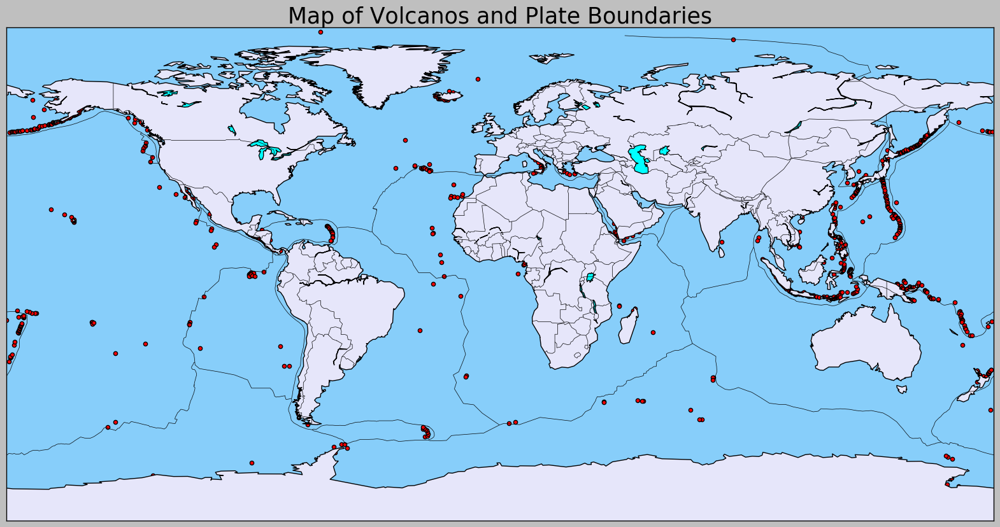
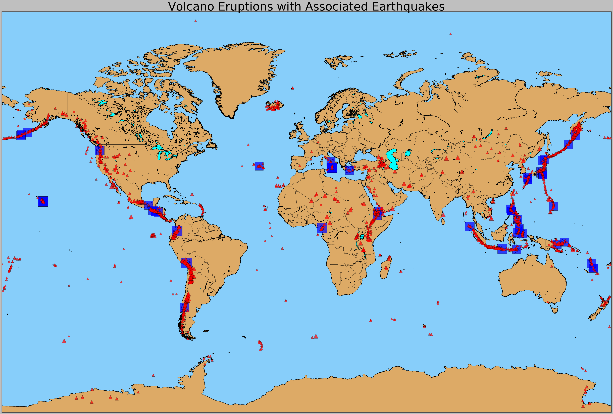
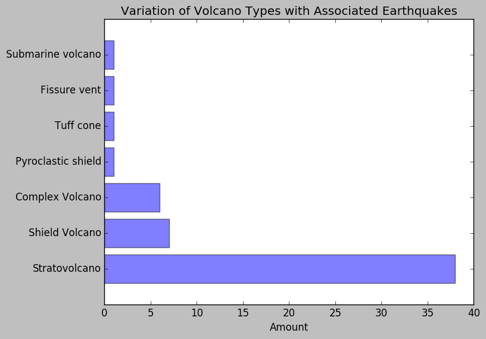
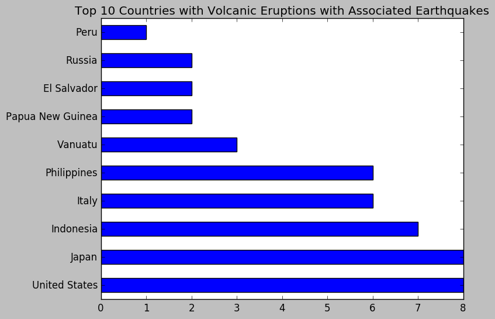
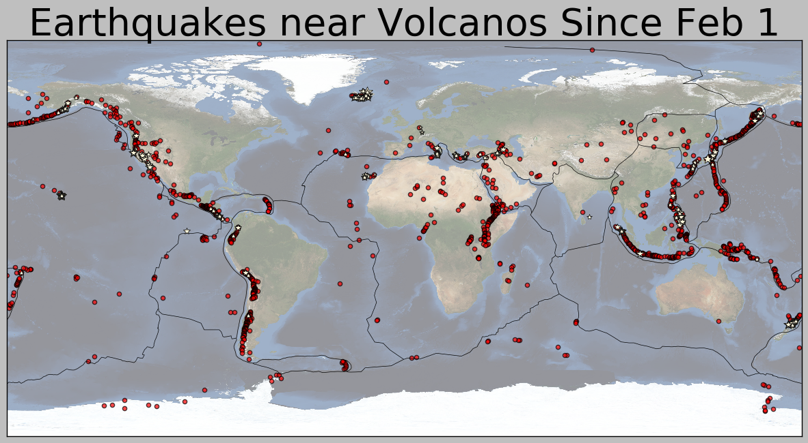
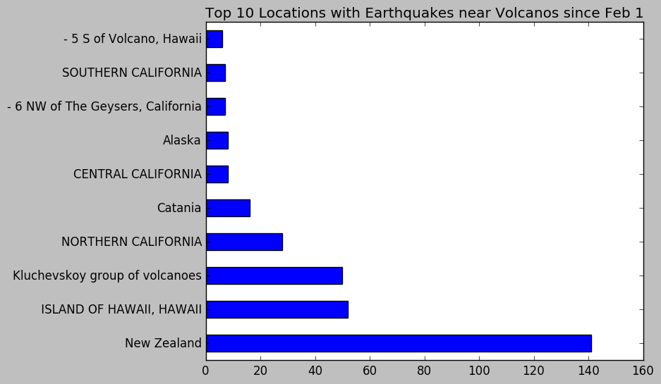
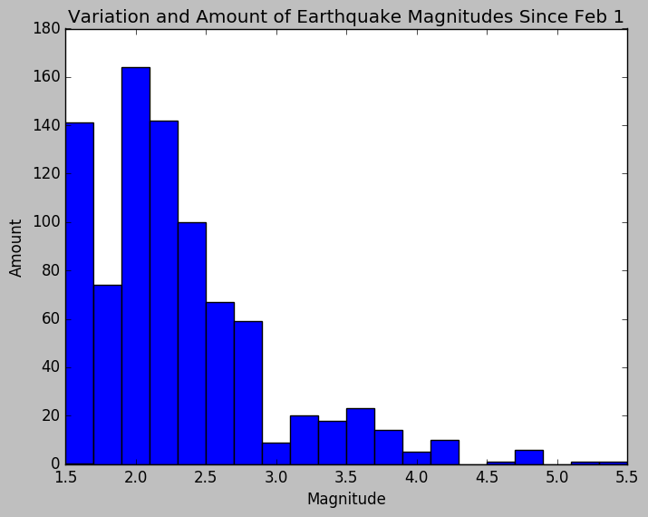
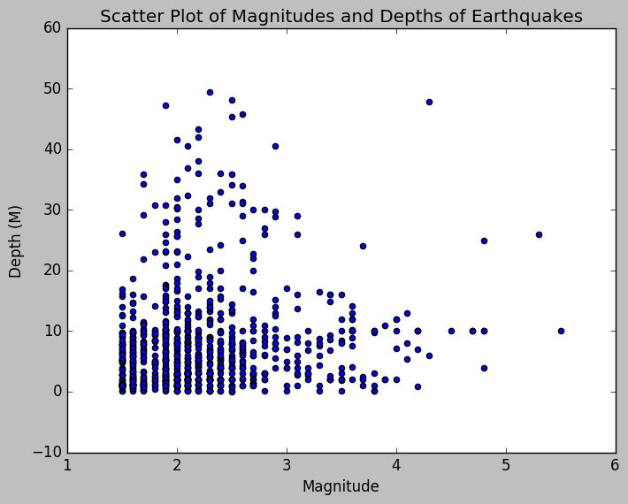
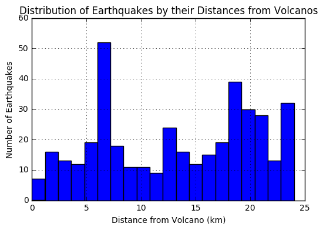

<h1>The Relationship Between Earthquakes and Volcanos</h1>

<h3>Part 4 By Natalie Marcom</h3> 

Adding onto the discussion of how earthquakes affect tsunamis, we will also discuss how earthquakes may affect volcanic eruptions. There are approximetely 1.5k active volcanos on earth. However, I will focus on connecting earthquakes and volcanic eruptions to stay within the scope of the class, as I am not a geophysicist.

I used data from NOAA, a website from Oregonstate.edu with the list of volcanos with their latitude and longitude, volcano and plate boundary shapefiles from ArcMap (Esri), as well as data from volcanodiscovery.org to find data concerning recent earthquakes near volcanos.


```python
import requests
from lxml import html
from mpl_toolkits.basemap import Basemap

import numpy as np
import pandas as pd
import matplotlib.pyplot as plt
```

Let's plot all 1500 volcanos on a map to see where most of them are located. Due to the difficulty to acquire a reasonable dataset of volcanos, besides a shapefile from Arcmap, we will scrape from a website that indicates the Latitude and longiude of all the volcanos to make plotting easy. We will also plot the volcanos on a basemap by the size of the volcano, via it's elevation height in meters.


```python
page = requests.get('http://volcano.oregonstate.edu/oldroot/volcanoes/alpha.html')
tree = html.fromstring(page.content)
tables = tree.xpath('//table')

volcano_data = []
for volc in range(4, len(tables)):
    df = pd.read_html(html.tostring(tables[volc]), header=0)[0]
    volcano_data.append(df)
```


```python
df_volc = pd.concat(volcano_data, ignore_index=True)

```

Let's look at a small snippet of the volcano dataset that was scraped. We will take note of the main observations of this dataset.


```python
df_volc.head(10)
```


<div>
<table border="1" class="dataframe">
  <thead>
    <tr style="text-align: right;">
      <th></th>
      <th>Name</th>
      <th>Location</th>
      <th>Type</th>
      <th>Latitude</th>
      <th>Longitude</th>
      <th>Elevation (m)</th>
    </tr>
  </thead>
  <tbody>
    <tr>
      <th>0</th>
      <td>Abu</td>
      <td>Honshu-Japan</td>
      <td>Shield volcanoes</td>
      <td>34.50</td>
      <td>131.60</td>
      <td>641.0</td>
    </tr>
    <tr>
      <th>1</th>
      <td>Acamarachi</td>
      <td>Chile-N</td>
      <td>Stratovolcano</td>
      <td>-23.30</td>
      <td>-67.62</td>
      <td>6046.0</td>
    </tr>
    <tr>
      <th>2</th>
      <td>Acatenango</td>
      <td>Guatemala</td>
      <td>Stratovolcano</td>
      <td>14.50</td>
      <td>-90.88</td>
      <td>3976.0</td>
    </tr>
    <tr>
      <th>3</th>
      <td>Acigöl-Nevsehir</td>
      <td>Turkey</td>
      <td>Caldera</td>
      <td>38.57</td>
      <td>34.52</td>
      <td>1689.0</td>
    </tr>
    <tr>
      <th>4</th>
      <td>Adams</td>
      <td>US-Washington</td>
      <td>Stratovolcano</td>
      <td>46.21</td>
      <td>-121.49</td>
      <td>3742.0</td>
    </tr>
    <tr>
      <th>5</th>
      <td>Adams  Seamount</td>
      <td>Pacific-C</td>
      <td>Submarine volcano</td>
      <td>-25.37</td>
      <td>-129.27</td>
      <td>-39.0</td>
    </tr>
    <tr>
      <th>6</th>
      <td>Adatara</td>
      <td>Honshu-Japan</td>
      <td>Stratovolcanoes</td>
      <td>37.64</td>
      <td>140.29</td>
      <td>1718.0</td>
    </tr>
    <tr>
      <th>7</th>
      <td>Adwa</td>
      <td>Ethiopia</td>
      <td>Stratovolcano</td>
      <td>10.07</td>
      <td>40.84</td>
      <td>1733.0</td>
    </tr>
    <tr>
      <th>8</th>
      <td>Afderà</td>
      <td>Ethiopia</td>
      <td>Stratovolcano</td>
      <td>13.08</td>
      <td>40.85</td>
      <td>1295.0</td>
    </tr>
    <tr>
      <th>9</th>
      <td>Agrigan</td>
      <td>Mariana Is-C Pacific</td>
      <td>Stratovolcano</td>
      <td>18.77</td>
      <td>145.67</td>
      <td>965.0</td>
    </tr>
  </tbody>
</table>
</div>


<h1>Where are the volcanos located? Are they near tetonic plates?<h1>


```python
import pandas as pd
from mpl_toolkits.basemap import Basemap
import matplotlib.pyplot as plt1
import matplotlib as mpl
import shapefile
from mpl_toolkits.basemap import Basemap
import geopandas as gp
```


```python
import os as osf
osf.chdir('C:\Users\jenat\\Documents\\ringoffire\\new')

volc = gp.GeoDataFrame.from_file('volcs.shp')
plt1.figure(figsize = (20, 12))
y = volc.LATX
x = volc.LONGX
map1 = Basemap()
map1.readshapefile('plate', 'plate')
map1.drawmapboundary(fill_color = 'lightskyblue')
map1.fillcontinents(color = 'lavender',lake_color = 'aqua')
map1.drawcountries()
map1.drawcoastlines()
volc_info = map1.readshapefile('volc1', 'volcs')

x1,y1 = map1(x,y)
map1.scatter(x1,y1,c = 'red',marker = "o",alpha = 1.0)
plt1.title("Map of Volcanos and Plate Boundaries", fontsize = 25)
plt1.show()
```





Using two shape files (one for plate bounaries, the other of the world's volcanos), we see that majority of the volcanos are very close to plate boundaries, that or they *are* along the tetonic plate boundaries.

------

However, besides plotting the volcanos on a map, let us take it a step further and plot volcanos as well as data that indicates whether one of these volcanos, had an eruption that was associated with an earthquake.  We will use two datasets to answer this question. The second dataset with the earthquake information mainly looks at volcano eruptions from 1790 to the present. I have decided to look at world volcanos for that data and not focus on a particular region of the world.

---------

<h1><u><center>How many of the volcanos have had eruptions that were associated with earthquakes?</center></h1></u>


```python
import os
import pandas as pd
from mpl_toolkits.basemap import Basemap
import numpy as np
import pandas as pd
import matplotlib.pyplot as plt
os.chdir('C:\Users\jenat\Documents')
#second dataset
data = pd.read_csv("new_world_data_results_up1.csv")
```


```python
data
```


<div>
<table border="1" class="dataframe">
  <thead>
    <tr style="text-align: right;">
      <th></th>
      <th>Year</th>
      <th>Month</th>
      <th>Day</th>
      <th>TSU</th>
      <th>EQ</th>
      <th>Name</th>
      <th>Location</th>
      <th>Country</th>
      <th>Latitude</th>
      <th>Longitude</th>
      <th>Elevation</th>
      <th>Type</th>
      <th>Status</th>
    </tr>
  </thead>
  <tbody>
    <tr>
      <th>0</th>
      <td>NaN</td>
      <td>NaN</td>
      <td>NaN</td>
      <td>NaN</td>
      <td>NaN</td>
      <td>NaN</td>
      <td>NaN</td>
      <td>NaN</td>
      <td>NaN</td>
      <td>NaN</td>
      <td>NaN</td>
      <td>NaN</td>
      <td>NaN</td>
    </tr>
    <tr>
      <th>1</th>
      <td>-1610.0</td>
      <td>NaN</td>
      <td>NaN</td>
      <td>TSU</td>
      <td>EQ</td>
      <td>Santorini</td>
      <td>Greece</td>
      <td>Greece</td>
      <td>36.404</td>
      <td>25.396</td>
      <td>329.0</td>
      <td>Shield volcano</td>
      <td>Historical</td>
    </tr>
    <tr>
      <th>2</th>
      <td>766.0</td>
      <td>7.0</td>
      <td>20.0</td>
      <td>TSU</td>
      <td>EQ</td>
      <td>Sakura-jima</td>
      <td>Kyushu-Japan</td>
      <td>Japan</td>
      <td>31.580</td>
      <td>130.670</td>
      <td>1117.0</td>
      <td>Stratovolcano</td>
      <td>Historical</td>
    </tr>
    <tr>
      <th>3</th>
      <td>1169.0</td>
      <td>2.0</td>
      <td>4.0</td>
      <td>TSU</td>
      <td>EQ</td>
      <td>Etna</td>
      <td>Italy</td>
      <td>Italy</td>
      <td>37.734</td>
      <td>15.004</td>
      <td>3350.0</td>
      <td>Stratovolcano</td>
      <td>Historical</td>
    </tr>
    <tr>
      <th>4</th>
      <td>1565.0</td>
      <td>8.0</td>
      <td>NaN</td>
      <td>NaN</td>
      <td>EQ</td>
      <td>Pacaya</td>
      <td>Guatemala</td>
      <td>Guatemala</td>
      <td>14.381</td>
      <td>-90.601</td>
      <td>2552.0</td>
      <td>Complex volcano</td>
      <td>Historical</td>
    </tr>
    <tr>
      <th>5</th>
      <td>1600.0</td>
      <td>2.0</td>
      <td>19.0</td>
      <td>NaN</td>
      <td>EQ</td>
      <td>Huaynaputina</td>
      <td>Peru</td>
      <td>Peru</td>
      <td>-16.608</td>
      <td>-70.850</td>
      <td>4850.0</td>
      <td>Stratovolcano</td>
      <td>Historical</td>
    </tr>
    <tr>
      <th>6</th>
      <td>1631.0</td>
      <td>2.0</td>
      <td>14.0</td>
      <td>NaN</td>
      <td>EQ</td>
      <td>Dama Ali</td>
      <td>Africa-NE</td>
      <td>Ethiopia</td>
      <td>11.280</td>
      <td>41.630</td>
      <td>1068.0</td>
      <td>Shield volcano</td>
      <td>Historical</td>
    </tr>
    <tr>
      <th>7</th>
      <td>1631.0</td>
      <td>12.0</td>
      <td>16.0</td>
      <td>TSU</td>
      <td>EQ</td>
      <td>Vesuvius</td>
      <td>Italy</td>
      <td>Italy</td>
      <td>40.821</td>
      <td>14.426</td>
      <td>1281.0</td>
      <td>Complex volcano</td>
      <td>Historical</td>
    </tr>
    <tr>
      <th>8</th>
      <td>1640.0</td>
      <td>7.0</td>
      <td>31.0</td>
      <td>TSU</td>
      <td>EQ</td>
      <td>Komaga-take</td>
      <td>Hokkaido-Japan</td>
      <td>Japan</td>
      <td>42.070</td>
      <td>140.680</td>
      <td>1140.0</td>
      <td>Stratovolcano</td>
      <td>Historical</td>
    </tr>
    <tr>
      <th>9</th>
      <td>1659.0</td>
      <td>9.0</td>
      <td>30.0</td>
      <td>NaN</td>
      <td>EQ</td>
      <td>San Salvador</td>
      <td>El Salvador</td>
      <td>El Salvador</td>
      <td>13.736</td>
      <td>-89.286</td>
      <td>1893.0</td>
      <td>Stratovolcano</td>
      <td>Historical</td>
    </tr>
    <tr>
      <th>10</th>
      <td>1669.0</td>
      <td>3.0</td>
      <td>11.0</td>
      <td>NaN</td>
      <td>EQ</td>
      <td>Etna</td>
      <td>Italy</td>
      <td>Italy</td>
      <td>37.734</td>
      <td>15.004</td>
      <td>3350.0</td>
      <td>Stratovolcano</td>
      <td>Historical</td>
    </tr>
    <tr>
      <th>11</th>
      <td>1679.0</td>
      <td>9.0</td>
      <td>21.0</td>
      <td>NaN</td>
      <td>EQ</td>
      <td>Zukur</td>
      <td>Red Sea</td>
      <td>Yemen</td>
      <td>14.020</td>
      <td>42.750</td>
      <td>624.0</td>
      <td>Shield volcano</td>
      <td>Holocene</td>
    </tr>
    <tr>
      <th>12</th>
      <td>1693.0</td>
      <td>1.0</td>
      <td>9.0</td>
      <td>NaN</td>
      <td>EQ</td>
      <td>Etna</td>
      <td>Italy</td>
      <td>Italy</td>
      <td>37.734</td>
      <td>15.004</td>
      <td>3350.0</td>
      <td>Stratovolcano</td>
      <td>Historical</td>
    </tr>
    <tr>
      <th>13</th>
      <td>1707.0</td>
      <td>12.0</td>
      <td>16.0</td>
      <td>NaN</td>
      <td>EQ</td>
      <td>Fuji</td>
      <td>Honshu-Japan</td>
      <td>Japan</td>
      <td>35.350</td>
      <td>138.730</td>
      <td>3776.0</td>
      <td>Stratovolcano</td>
      <td>Historical</td>
    </tr>
    <tr>
      <th>14</th>
      <td>1716.0</td>
      <td>9.0</td>
      <td>24.0</td>
      <td>TSU</td>
      <td>EQ</td>
      <td>Taal</td>
      <td>Luzon-Philippines</td>
      <td>Philippines</td>
      <td>14.002</td>
      <td>120.993</td>
      <td>400.0</td>
      <td>Stratovolcano</td>
      <td>Historical</td>
    </tr>
    <tr>
      <th>15</th>
      <td>1741.0</td>
      <td>8.0</td>
      <td>23.0</td>
      <td>TSU</td>
      <td>EQ</td>
      <td>Oshima-Oshima</td>
      <td>Hokkaido-Japan</td>
      <td>Japan</td>
      <td>41.500</td>
      <td>139.370</td>
      <td>737.0</td>
      <td>Stratovolcano</td>
      <td>Historical</td>
    </tr>
    <tr>
      <th>16</th>
      <td>1749.0</td>
      <td>8.0</td>
      <td>11.0</td>
      <td>TSU</td>
      <td>EQ</td>
      <td>Taal</td>
      <td>Luzon-Philippines</td>
      <td>Philippines</td>
      <td>14.002</td>
      <td>120.993</td>
      <td>400.0</td>
      <td>Stratovolcano</td>
      <td>Historical</td>
    </tr>
    <tr>
      <th>17</th>
      <td>1754.0</td>
      <td>5.0</td>
      <td>13.0</td>
      <td>TSU</td>
      <td>EQ</td>
      <td>Taal</td>
      <td>Luzon-Philippines</td>
      <td>Philippines</td>
      <td>14.002</td>
      <td>120.993</td>
      <td>400.0</td>
      <td>Stratovolcano</td>
      <td>Historical</td>
    </tr>
    <tr>
      <th>18</th>
      <td>1757.0</td>
      <td>7.0</td>
      <td>9.0</td>
      <td>NaN</td>
      <td>EQ</td>
      <td>San Jorge</td>
      <td>Azores</td>
      <td>Portugal</td>
      <td>38.650</td>
      <td>-28.080</td>
      <td>1053.0</td>
      <td>Fissure vent</td>
      <td>Historical</td>
    </tr>
    <tr>
      <th>19</th>
      <td>1792.0</td>
      <td>5.0</td>
      <td>21.0</td>
      <td>TSU</td>
      <td>EQ</td>
      <td>Unzen</td>
      <td>Kyushu-Japan</td>
      <td>Japan</td>
      <td>32.750</td>
      <td>130.300</td>
      <td>1500.0</td>
      <td>Complex volcano</td>
      <td>Historical</td>
    </tr>
    <tr>
      <th>20</th>
      <td>1820.0</td>
      <td>3.0</td>
      <td>1.0</td>
      <td>TSU</td>
      <td>EQ</td>
      <td>Westdahl</td>
      <td>Aleutian Is</td>
      <td>United States</td>
      <td>54.520</td>
      <td>-164.650</td>
      <td>1654.0</td>
      <td>Stratovolcano</td>
      <td>Historical</td>
    </tr>
    <tr>
      <th>21</th>
      <td>1827.0</td>
      <td>6.0</td>
      <td>27.0</td>
      <td>TSU</td>
      <td>EQ</td>
      <td>Avachinsky</td>
      <td>Kamchatka</td>
      <td>Russia</td>
      <td>53.255</td>
      <td>158.830</td>
      <td>2741.0</td>
      <td>Stratovolcano</td>
      <td>Historical</td>
    </tr>
    <tr>
      <th>22</th>
      <td>1837.0</td>
      <td>9.0</td>
      <td>NaN</td>
      <td>TSU</td>
      <td>EQ</td>
      <td>Peuet Sague</td>
      <td>Sumatra</td>
      <td>Indonesia</td>
      <td>4.914</td>
      <td>96.329</td>
      <td>2801.0</td>
      <td>Complex volcano</td>
      <td>Historical</td>
    </tr>
    <tr>
      <th>23</th>
      <td>1840.0</td>
      <td>2.0</td>
      <td>2.0</td>
      <td>TSU</td>
      <td>EQ</td>
      <td>Gamalama</td>
      <td>Halmahera-Indonesia</td>
      <td>Indonesia</td>
      <td>0.800</td>
      <td>127.325</td>
      <td>1715.0</td>
      <td>Stratovolcano</td>
      <td>Historical</td>
    </tr>
    <tr>
      <th>24</th>
      <td>1845.0</td>
      <td>2.0</td>
      <td>8.0</td>
      <td>TSU</td>
      <td>EQ</td>
      <td>Soputan</td>
      <td>Sulawesi-Indonesia</td>
      <td>Indonesia</td>
      <td>1.108</td>
      <td>124.725</td>
      <td>1784.0</td>
      <td>Stratovolcano</td>
      <td>Historical</td>
    </tr>
    <tr>
      <th>25</th>
      <td>1857.0</td>
      <td>4.0</td>
      <td>17.0</td>
      <td>TSU</td>
      <td>EQ</td>
      <td>Umboi</td>
      <td>New Guinea-NE of</td>
      <td>Papua New Guinea</td>
      <td>-5.589</td>
      <td>147.875</td>
      <td>1548.0</td>
      <td>Complex volcano</td>
      <td>Holocene</td>
    </tr>
    <tr>
      <th>26</th>
      <td>1863.0</td>
      <td>8.0</td>
      <td>17.0</td>
      <td>TSU</td>
      <td>EQ</td>
      <td>Yasur</td>
      <td>Vanuatu-SW Pacific</td>
      <td>Vanuatu</td>
      <td>-19.520</td>
      <td>169.425</td>
      <td>361.0</td>
      <td>Stratovolcano</td>
      <td>Historical</td>
    </tr>
    <tr>
      <th>27</th>
      <td>1868.0</td>
      <td>4.0</td>
      <td>3.0</td>
      <td>TSU</td>
      <td>EQ</td>
      <td>Mauna Loa</td>
      <td>Hawaiian Is</td>
      <td>United States</td>
      <td>19.475</td>
      <td>-155.608</td>
      <td>4170.0</td>
      <td>Shield volcano</td>
      <td>Historical</td>
    </tr>
    <tr>
      <th>28</th>
      <td>1868.0</td>
      <td>9.0</td>
      <td>5.0</td>
      <td>TSU</td>
      <td>EQ</td>
      <td>Etna</td>
      <td>Italy</td>
      <td>Italy</td>
      <td>37.734</td>
      <td>15.004</td>
      <td>3350.0</td>
      <td>Stratovolcano</td>
      <td>Historical</td>
    </tr>
    <tr>
      <th>29</th>
      <td>1871.0</td>
      <td>4.0</td>
      <td>30.0</td>
      <td>TSU</td>
      <td>EQ</td>
      <td>Camiguin</td>
      <td>Mindanao-Philippines</td>
      <td>Philippines</td>
      <td>9.203</td>
      <td>124.673</td>
      <td>1332.0</td>
      <td>Stratovolcano</td>
      <td>Historical</td>
    </tr>
    <tr>
      <th>30</th>
      <td>1877.0</td>
      <td>2.0</td>
      <td>14.0</td>
      <td>TSU</td>
      <td>EQ</td>
      <td>Mauna Loa</td>
      <td>Hawaiian Is</td>
      <td>United States</td>
      <td>19.475</td>
      <td>-155.608</td>
      <td>4170.0</td>
      <td>Shield volcano</td>
      <td>Historical</td>
    </tr>
    <tr>
      <th>31</th>
      <td>1878.0</td>
      <td>2.0</td>
      <td>11.0</td>
      <td>TSU</td>
      <td>EQ</td>
      <td>Yasur</td>
      <td>Vanuatu-SW Pacific</td>
      <td>Vanuatu</td>
      <td>-19.520</td>
      <td>169.425</td>
      <td>361.0</td>
      <td>Stratovolcano</td>
      <td>Historical</td>
    </tr>
    <tr>
      <th>32</th>
      <td>1878.0</td>
      <td>8.0</td>
      <td>29.0</td>
      <td>TSU</td>
      <td>EQ</td>
      <td>Okmok</td>
      <td>Aleutian Is</td>
      <td>United States</td>
      <td>53.420</td>
      <td>-168.130</td>
      <td>1073.0</td>
      <td>Shield volcano</td>
      <td>Historical</td>
    </tr>
    <tr>
      <th>33</th>
      <td>1885.0</td>
      <td>5.0</td>
      <td>25.0</td>
      <td>NaN</td>
      <td>EQ</td>
      <td>Purace</td>
      <td>Colombia</td>
      <td>Colombia</td>
      <td>2.320</td>
      <td>-76.400</td>
      <td>4650.0</td>
      <td>Stratovolcano</td>
      <td>Historical</td>
    </tr>
    <tr>
      <th>34</th>
      <td>1889.0</td>
      <td>9.0</td>
      <td>6.0</td>
      <td>TSU</td>
      <td>EQ</td>
      <td>Banua Wuhu</td>
      <td>Sangihe Is-Indonesia</td>
      <td>Indonesia</td>
      <td>3.138</td>
      <td>125.491</td>
      <td>-5.0</td>
      <td>Submarine volcano</td>
      <td>Historical</td>
    </tr>
    <tr>
      <th>35</th>
      <td>1901.0</td>
      <td>8.0</td>
      <td>9.0</td>
      <td>TSU</td>
      <td>EQ</td>
      <td>Epi</td>
      <td>Vanuatu-SW Pacific</td>
      <td>Vanuatu</td>
      <td>-16.680</td>
      <td>168.370</td>
      <td>833.0</td>
      <td>Stratovolcano</td>
      <td>Historical</td>
    </tr>
    <tr>
      <th>36</th>
      <td>1909.0</td>
      <td>4.0</td>
      <td>28.0</td>
      <td>NaN</td>
      <td>EQ</td>
      <td>Cameroon, Mt.</td>
      <td>Africa-W</td>
      <td>Cameroon</td>
      <td>4.203</td>
      <td>9.170</td>
      <td>4095.0</td>
      <td>Stratovolcano</td>
      <td>Historical</td>
    </tr>
    <tr>
      <th>37</th>
      <td>1911.0</td>
      <td>1.0</td>
      <td>30.0</td>
      <td>TSU</td>
      <td>EQ</td>
      <td>Taal</td>
      <td>Luzon-Philippines</td>
      <td>Philippines</td>
      <td>14.002</td>
      <td>120.993</td>
      <td>400.0</td>
      <td>Stratovolcano</td>
      <td>Historical</td>
    </tr>
    <tr>
      <th>38</th>
      <td>1913.0</td>
      <td>3.0</td>
      <td>14.0</td>
      <td>TSU</td>
      <td>EQ</td>
      <td>Awu</td>
      <td>Sangihe Is-Indonesia</td>
      <td>Indonesia</td>
      <td>3.670</td>
      <td>125.500</td>
      <td>1320.0</td>
      <td>Stratovolcano</td>
      <td>Historical</td>
    </tr>
    <tr>
      <th>39</th>
      <td>1914.0</td>
      <td>1.0</td>
      <td>12.0</td>
      <td>TSU</td>
      <td>EQ</td>
      <td>Sakura-jima</td>
      <td>Kyushu-Japan</td>
      <td>Japan</td>
      <td>31.580</td>
      <td>130.670</td>
      <td>1117.0</td>
      <td>Stratovolcano</td>
      <td>Historical</td>
    </tr>
    <tr>
      <th>40</th>
      <td>1917.0</td>
      <td>6.0</td>
      <td>7.0</td>
      <td>NaN</td>
      <td>EQ</td>
      <td>San Salvador</td>
      <td>El Salvador</td>
      <td>El Salvador</td>
      <td>13.736</td>
      <td>-89.286</td>
      <td>1893.0</td>
      <td>Stratovolcano</td>
      <td>Historical</td>
    </tr>
    <tr>
      <th>41</th>
      <td>1933.0</td>
      <td>1.0</td>
      <td>8.0</td>
      <td>TSU</td>
      <td>EQ</td>
      <td>Kharimkotan</td>
      <td>Kuril Is</td>
      <td>Russia</td>
      <td>49.120</td>
      <td>154.508</td>
      <td>1145.0</td>
      <td>Stratovolcano</td>
      <td>Historical</td>
    </tr>
    <tr>
      <th>42</th>
      <td>1937.0</td>
      <td>5.0</td>
      <td>29.0</td>
      <td>TSU</td>
      <td>EQ</td>
      <td>Rabaul</td>
      <td>New Britain-SW Pac</td>
      <td>Papua New Guinea</td>
      <td>-4.271</td>
      <td>152.203</td>
      <td>688.0</td>
      <td>Pyroclastic shield</td>
      <td>Historical</td>
    </tr>
    <tr>
      <th>43</th>
      <td>1951.0</td>
      <td>8.0</td>
      <td>3.0</td>
      <td>TSU</td>
      <td>EQ</td>
      <td>Cosiguina</td>
      <td>Nicaragua</td>
      <td>Nicaragua</td>
      <td>12.980</td>
      <td>-87.570</td>
      <td>872.0</td>
      <td>Stratovolcano</td>
      <td>Historical</td>
    </tr>
    <tr>
      <th>44</th>
      <td>1957.0</td>
      <td>3.0</td>
      <td>11.0</td>
      <td>NaN</td>
      <td>EQ</td>
      <td>Vsevidof</td>
      <td>Aleutian Is</td>
      <td>United States</td>
      <td>53.130</td>
      <td>-168.680</td>
      <td>2149.0</td>
      <td>Stratovolcano</td>
      <td>Historical</td>
    </tr>
    <tr>
      <th>45</th>
      <td>1960.0</td>
      <td>5.0</td>
      <td>25.0</td>
      <td>TSU</td>
      <td>EQ</td>
      <td>Puyehue</td>
      <td>Chile-C</td>
      <td>Chile</td>
      <td>-40.590</td>
      <td>-72.117</td>
      <td>2236.0</td>
      <td>Stratovolcano</td>
      <td>Holocene</td>
    </tr>
    <tr>
      <th>46</th>
      <td>1963.0</td>
      <td>5.0</td>
      <td>16.0</td>
      <td>NaN</td>
      <td>EQ</td>
      <td>Agung</td>
      <td>Lesser Sunda Is</td>
      <td>Indonesia</td>
      <td>-8.342</td>
      <td>115.508</td>
      <td>3142.0</td>
      <td>Stratovolcano</td>
      <td>Historical</td>
    </tr>
    <tr>
      <th>47</th>
      <td>1975.0</td>
      <td>11.0</td>
      <td>29.0</td>
      <td>TSU</td>
      <td>EQ</td>
      <td>Kilauea</td>
      <td>Hawaiian Is</td>
      <td>United States</td>
      <td>19.425</td>
      <td>-155.292</td>
      <td>1222.0</td>
      <td>Shield volcano</td>
      <td>Historical</td>
    </tr>
    <tr>
      <th>48</th>
      <td>1980.0</td>
      <td>5.0</td>
      <td>18.0</td>
      <td>TSU</td>
      <td>EQ</td>
      <td>St. Helens</td>
      <td>US-Washington</td>
      <td>United States</td>
      <td>46.200</td>
      <td>-122.180</td>
      <td>2549.0</td>
      <td>Stratovolcano</td>
      <td>Historical</td>
    </tr>
    <tr>
      <th>49</th>
      <td>1982.0</td>
      <td>3.0</td>
      <td>28.0</td>
      <td>NaN</td>
      <td>EQ</td>
      <td>Chichon, El</td>
      <td>Mexico</td>
      <td>Mexico</td>
      <td>17.360</td>
      <td>-93.228</td>
      <td>1150.0</td>
      <td>Tuff cone</td>
      <td>Historical</td>
    </tr>
    <tr>
      <th>50</th>
      <td>1983.0</td>
      <td>10.0</td>
      <td>3.0</td>
      <td>NaN</td>
      <td>EQ</td>
      <td>Miyake-jima</td>
      <td>Izu Is-Japan</td>
      <td>Japan</td>
      <td>34.080</td>
      <td>139.530</td>
      <td>815.0</td>
      <td>Stratovolcano</td>
      <td>Historical</td>
    </tr>
    <tr>
      <th>51</th>
      <td>1987.0</td>
      <td>12.0</td>
      <td>1.0</td>
      <td>NaN</td>
      <td>EQ</td>
      <td>Sirung</td>
      <td>Lesser Sunda Is</td>
      <td>Indonesia</td>
      <td>-8.510</td>
      <td>124.148</td>
      <td>862.0</td>
      <td>Complex volcano</td>
      <td>Historical</td>
    </tr>
    <tr>
      <th>52</th>
      <td>1991.0</td>
      <td>6.0</td>
      <td>15.0</td>
      <td>NaN</td>
      <td>EQ</td>
      <td>Pinatubo</td>
      <td>Luzon-Philippines</td>
      <td>Philippines</td>
      <td>15.130</td>
      <td>120.350</td>
      <td>1486.0</td>
      <td>Stratovolcano</td>
      <td>Historical</td>
    </tr>
    <tr>
      <th>53</th>
      <td>2000.0</td>
      <td>6.0</td>
      <td>27.0</td>
      <td>TSU</td>
      <td>EQ</td>
      <td>Miyake-jima</td>
      <td>Izu Is-Japan</td>
      <td>Japan</td>
      <td>34.080</td>
      <td>139.530</td>
      <td>815.0</td>
      <td>Stratovolcano</td>
      <td>Historical</td>
    </tr>
    <tr>
      <th>54</th>
      <td>2002.0</td>
      <td>8.0</td>
      <td>28.0</td>
      <td>NaN</td>
      <td>EQ</td>
      <td>Etna</td>
      <td>Italy</td>
      <td>Italy</td>
      <td>37.734</td>
      <td>15.004</td>
      <td>3350.0</td>
      <td>Stratovolcano</td>
      <td>Historical</td>
    </tr>
    <tr>
      <th>55</th>
      <td>2010.0</td>
      <td>5.0</td>
      <td>29.0</td>
      <td>TSU</td>
      <td>EQ</td>
      <td>Sarigan</td>
      <td>Mariana Is-C Pacific</td>
      <td>United States</td>
      <td>16.708</td>
      <td>145.780</td>
      <td>538.0</td>
      <td>Stratovolcano</td>
      <td>Holocene</td>
    </tr>
  </tbody>
</table>
</div>


```python
def plot_map2(lons, lats, elevations, llcrnrlat = -80, urcrnrlat = 90, llcrnrlon = -180, urcrnrlon = 180,resolution = 'i', projection='mill', lat_0 = 39.5, lon_0 = 1,min_marker_size=5):
    bins = np.linspace(0, elevations.max(), 10)
    marker_sizes = np.digitize(elevations, bins) + min_marker_size
    m2 = Basemap(projection=projection, llcrnrlat=llcrnrlat, urcrnrlat=urcrnrlat, llcrnrlon=llcrnrlon, urcrnrlon=urcrnrlon, resolution=resolution)
    m2.drawcountries()
    m2.drawmapboundary(fill_color='lightskyblue')
    m2.fillcontinents(color = '#ddaa66',lake_color='aqua')
    m2.drawcoastlines()

    for lon, lat, m2size in zip(lons, lats, marker_sizes):
        x, y = m2(lon, lat)
        m2.plot(x, y, 'bs', markersize=m2size, alpha=.7, zorder=4)

    return m2

def plot_map1(lons, lats, elevations, llcrnrlat=-80, urcrnrlat=90, llcrnrlon=-180, urcrnrlon=180,resolution='i', projection='mill', lat_0 = 39.5, lon_0 = 1,min_marker_size=2):
    bins = np.linspace(0, elevations.max(), 10)
    marker_sizes = np.digitize(elevations, bins) + min_marker_size
    m = Basemap(projection=projection, llcrnrlat=llcrnrlat, urcrnrlat=urcrnrlat, llcrnrlon=llcrnrlon, urcrnrlon=urcrnrlon, resolution=resolution)
    m.drawcountries()
    m.drawmapboundary(fill_color='lightskyblue')
    m.fillcontinents(color = '#ddaa66',lake_color='aqua')
    m.drawcoastlines()

    for lon, lat, msize in zip(lons, lats, marker_sizes):
        x, y = m(lon, lat)
        m.plot(x, y, '^r', markersize=msize, alpha=.7, zorder=4)

    return m

plt.figure(figsize=(60, 30))
m2 = plot_map2(data['Longitude'], data['Latitude'], data['Elevation'], min_marker_size=35)
m = plot_map1(df_volc['Longitude'], df_volc['Latitude'], df_volc['Elevation (m)'], min_marker_size=10)


plt.title('Volcano Eruptions with Associated Earthquakes', color='#000000', fontsize=50)

plt.show()
```





----

In the original NOAA dataset, there are 797 volcanic eruption observations, and 55 of them are eruptions associated with earthquakes. Taking this into account from this dataset (Volcanic eruptions from 1790-2016), <b>6.9% of the volcanic eruptions from the NOAA dataset, had an association with an earthquake</b>.

-------

The red triangles indicate the volcanos, and the blue squares indicate the volcanos who had an association with an earthquake prior to its eruption. Out of 1500 volcanos, there were about 55 volcanic eruptions that had this association. Many have these occurred in the 20th century. We also see that the majority of these earthquake and volcano association have happened along the ring of fire, which stretches along the Eastern edge of Asia, down to New Zealand, as well as from Alaska down to South America.

-----------

<h1><center><u>Closer Examination of Volcano Eruptions with Associated Earthquakes</h1></u></center>

Let's examine the different types of volcanos as well as the top 10 countries that had the most volcanic eruptions with associated earthquakes. Is there a particular region that had the most volcano eruptions?


```python
import matplotlib.pyplot as plt; plt.rcdefaults()
import numpy as np
import matplotlib.pyplot as plt
```

<h3>Is there a type of Volcano that is more frequent with eruptions?</h3>


```python
objects = ('Stratovolcano', 'Shield Volcano', 'Complex Volcano', 'Pyroclastic shield', 'Tuff cone', 'Fissure vent','Submarine volcano')
y_pos = np.arange(len(objects))
performance = [38,7,6,1,1,1,1]
plt.barh(y_pos, performance, align='center', alpha=0.5)
plt.yticks(y_pos, objects)
plt.xlabel('Amount')
plt.title('Variation of Volcano Types with Associated Earthquakes')
plt.show()
```





We see that stratovolcanos (for instance Mount St.Helens, is a stratovolcano) had the overall highest frequency of volcanic eruptions, and by a large proportion.

<h3> Which country has had volcanic eruptions the most?</h3>


```python
data['Country'].value_counts()[:10].plot(kind = 'barh', title = 'Top 10 Countries with Volcanic Eruptions with Associated Earthquakes')
plt.show()
```





We see that the United States and Japan have an equal amount of volcanic eruptions that had associations with earthquakes.

<h5>Due to the lack of magnitude observation, from the NOAA data (which gave an option of volcanic eruptions with association of earthquakes), a goal is to have a better observation of more detailed variables to help establish a correlatiopn between earthquakes and volcanic eruptions. However, because this is a topic that scientists are still debating, and many do not see an exact correlation between the two, we will take a different approach that may lead us to answers that we are looking for, which is establishing a correlation between earthquakes and volcanos.

<h2><center>Using data concerning earthquakes occurring close to volcanos</h2>

<h1><center><u>Examining link between Earthquakes and Volcanic eruptions</u></center></h1>

As stated before, scientists still are debating whether earthquakes and volcanic eruptions are connected or not, and there is a lack of information available that proved that the two are substantially linked to one or the other. However, I have found enough data indicating that earthquakes do occur near volcanos, which can suggest that it is *possible* for earthquakes and volcanos to be somewhat linked.

<h2>Is it possible for earthquakes and volcanos to come into close contact with one another?<h2>


```python
import os
os.chdir('C:\Users\jenat\\Documents\\ringoffire')
import pandas as pd
import numpy as np
from mpl_toolkits.basemap import Basemap
import matplotlib.pyplot as plt
import matplotlib as mpl

```


```python
os.chdir('C:\Users\jenat\Documents\\ringoffire')
eqdata = pd.read_csv('earthquakesdata.csv')#dataset
eqdata1 = eqdata.convert_objects(convert_numeric=True)
```

    C:\Users\jenat\Anaconda2\lib\site-packages\ipykernel\__main__.py:3: FutureWarning: convert_objects is deprecated.  Use the data-type specific converters pd.to_datetime, pd.to_timedelta and pd.to_numeric.
      app.launch_new_instance()


<h2><center><u>Feb and March 2017 Earthquakes near Volcano data:</u></h2></center>


```python
eqdata1
```


<div>
<table border="1" class="dataframe">
  <thead>
    <tr style="text-align: right;">
      <th></th>
      <th>Time</th>
      <th>Mag</th>
      <th>Depth</th>
      <th>Location</th>
      <th>Latitude</th>
      <th>Longitude</th>
    </tr>
  </thead>
  <tbody>
    <tr>
      <th>0</th>
      <td>Sat, 18 ar 19:47 UTC</td>
      <td>2.3</td>
      <td>13.2</td>
      <td>- 3 SSW of Volcano, Hawaii</td>
      <td>19.4000</td>
      <td>-155.2500</td>
    </tr>
    <tr>
      <th>1</th>
      <td>Sat, 18 ar 14:48 UTC</td>
      <td>1.9</td>
      <td>17.6</td>
      <td>11  SSW fro Corinth</td>
      <td>19.3975</td>
      <td>-155.2522</td>
    </tr>
    <tr>
      <th>2</th>
      <td>Sat, 18 ar 13:57 UTC</td>
      <td>1.6</td>
      <td>2.2</td>
      <td>4.6  SSW of Her�ubrei�</td>
      <td>37.7902</td>
      <td>14.9158</td>
    </tr>
    <tr>
      <th>3</th>
      <td>Sat, 18 ar 13:13 UTC</td>
      <td>2.3</td>
      <td>1</td>
      <td>016  S 66? W of Wao (Lanao Del Sur)</td>
      <td>37.8527</td>
      <td>22.8490</td>
    </tr>
    <tr>
      <th>4</th>
      <td>Sat, 18 ar 12:57 UTC</td>
      <td>2.2</td>
      <td>27.7</td>
      <td>- 5 NNW of Volcano, Hawaii</td>
      <td>65.1360</td>
      <td>-16.3860</td>
    </tr>
    <tr>
      <th>5</th>
      <td>Sat, 18 ar 12:29 UTC</td>
      <td>1.8</td>
      <td>1.8</td>
      <td>- 5 WSW of Volcano, Hawaii</td>
      <td>7.5900</td>
      <td>124.6200</td>
    </tr>
    <tr>
      <th>6</th>
      <td>Sat, 18 ar 12:08 UTC</td>
      <td>1.6</td>
      <td>0.7</td>
      <td>2.7  ESE of Go�abunga</td>
      <td>19.4768</td>
      <td>-155.2662</td>
    </tr>
    <tr>
      <th>7</th>
      <td>Sat, 18 ar 11:41 UTC</td>
      <td>1.8</td>
      <td>4</td>
      <td>3.7  SW of Her�ubrei�</td>
      <td>19.4047</td>
      <td>-155.2835</td>
    </tr>
    <tr>
      <th>8</th>
      <td>Sat, 18 ar 11:27 UTC</td>
      <td>3</td>
      <td>17</td>
      <td>012  S 87? W of Wao (Lanao Del Sur)I FELT IT</td>
      <td>19.4372</td>
      <td>-155.6165</td>
    </tr>
    <tr>
      <th>9</th>
      <td>Sat, 18 ar 11:20 UTC</td>
      <td>1.5</td>
      <td>4</td>
      <td>4.1  SW of Her�ubrei�</td>
      <td>63.6350</td>
      <td>-19.1960</td>
    </tr>
    <tr>
      <th>10</th>
      <td>Sat, 18 ar 10:51 UTC</td>
      <td>4.7</td>
      <td>10</td>
      <td>Northern Suatra, IndonesiaI FELT IT</td>
      <td>65.1510</td>
      <td>-16.4060</td>
    </tr>
    <tr>
      <th>11</th>
      <td>Sat, 18 ar 10:43 UTC</td>
      <td>1.6</td>
      <td>3.3</td>
      <td>3.8  SW of Her�ubrei�</td>
      <td>7.6400</td>
      <td>124.6500</td>
    </tr>
    <tr>
      <th>12</th>
      <td>Sat, 18 ar 10:07 UTC</td>
      <td>2.3</td>
      <td>3.1</td>
      <td>3.1  SW of Her�ubrei�</td>
      <td>65.1460</td>
      <td>-16.4070</td>
    </tr>
    <tr>
      <th>13</th>
      <td>Sat, 18 ar 10:07 UTC</td>
      <td>1.6</td>
      <td>6.4</td>
      <td>4.4  SW of Her�ubrei�</td>
      <td>3.4200</td>
      <td>98.4800</td>
    </tr>
    <tr>
      <th>14</th>
      <td>Sat, 18 ar 09:51 UTC</td>
      <td>1.6</td>
      <td>7.7</td>
      <td>5.7  SW of Her�ubrei�</td>
      <td>65.1500</td>
      <td>-16.4070</td>
    </tr>
    <tr>
      <th>15</th>
      <td>Sat, 18 ar 09:28 UTC</td>
      <td>1.6</td>
      <td>4.8</td>
      <td>5.3  SW of Her�ubrei�</td>
      <td>65.1570</td>
      <td>-16.4030</td>
    </tr>
    <tr>
      <th>16</th>
      <td>Sat, 18 ar 09:25 UTC</td>
      <td>2</td>
      <td>4.8</td>
      <td>5.3  SW of Her�ubrei�</td>
      <td>65.1460</td>
      <td>-16.4140</td>
    </tr>
    <tr>
      <th>17</th>
      <td>Sat, 18 ar 09:25 UTC</td>
      <td>1.5</td>
      <td>9.2</td>
      <td>5.1  N of Her�ubrei�art�gl</td>
      <td>65.1370</td>
      <td>-16.4340</td>
    </tr>
    <tr>
      <th>18</th>
      <td>Sat, 18 ar 08:59 UTC</td>
      <td>1.5</td>
      <td>7.6</td>
      <td>3.1  N of B�r�arbunga</td>
      <td>65.1370</td>
      <td>-16.4200</td>
    </tr>
    <tr>
      <th>19</th>
      <td>Sat, 18 ar 08:44 UTC</td>
      <td>1.6</td>
      <td>3.8</td>
      <td>- 11 WNW of Calipatria, CA</td>
      <td>65.1350</td>
      <td>-16.4140</td>
    </tr>
    <tr>
      <th>20</th>
      <td>Sat, 18 ar 08:40 UTC</td>
      <td>2.1</td>
      <td>3.4</td>
      <td>4.0  SW of Her�ubrei�</td>
      <td>65.1330</td>
      <td>-16.3990</td>
    </tr>
    <tr>
      <th>21</th>
      <td>Sat, 18 ar 08:26 UTC</td>
      <td>2.5</td>
      <td>4</td>
      <td>SOUTHERN CALIFORNIA</td>
      <td>64.6680</td>
      <td>-17.5160</td>
    </tr>
    <tr>
      <th>22</th>
      <td>Sat, 18 ar 08:26 UTC</td>
      <td>1.5</td>
      <td>4.8</td>
      <td>4.6  SW of Her�ubrei�</td>
      <td>33.1607</td>
      <td>-115.6203</td>
    </tr>
    <tr>
      <th>23</th>
      <td>Sat, 18 ar 06:47 UTC</td>
      <td>1.5</td>
      <td>6.6</td>
      <td>4.8  SW of Her�ubrei�</td>
      <td>65.1480</td>
      <td>-16.4070</td>
    </tr>
    <tr>
      <th>24</th>
      <td>Sat, 18 ar 06:22 UTC</td>
      <td>2.9</td>
      <td>7.1</td>
      <td>5.1  SW of Her�ubrei�I FELT IT</td>
      <td>33.1500</td>
      <td>-115.6300</td>
    </tr>
    <tr>
      <th>25</th>
      <td>Sat, 18 ar 06:22 UTC</td>
      <td>2.1</td>
      <td>3.3</td>
      <td>5.0  SW of Her�ubrei�</td>
      <td>65.1440</td>
      <td>-16.4170</td>
    </tr>
    <tr>
      <th>26</th>
      <td>Sat, 18 ar 05:28 UTC</td>
      <td>2.4</td>
      <td>5.1</td>
      <td>4.9  SW of Her�ubrei�</td>
      <td>65.1450</td>
      <td>-16.4230</td>
    </tr>
    <tr>
      <th>27</th>
      <td>Sat, 18 ar 05:28 UTC</td>
      <td>2.2</td>
      <td>5.1</td>
      <td>4.9  SW of Her�ubrei�</td>
      <td>65.1410</td>
      <td>-16.4240</td>
    </tr>
    <tr>
      <th>28</th>
      <td>Sat, 18 ar 05:05 UTC</td>
      <td>2</td>
      <td>26.4</td>
      <td>- 5 NW of Volcano, Hawaii</td>
      <td>65.1420</td>
      <td>-16.4240</td>
    </tr>
    <tr>
      <th>29</th>
      <td>Sat, 18 ar 04:37 UTC</td>
      <td>1.5</td>
      <td>3.6</td>
      <td>3.8  SW of Her�ubrei�</td>
      <td>65.1440</td>
      <td>-16.4250</td>
    </tr>
    <tr>
      <th>...</th>
      <td>...</td>
      <td>...</td>
      <td>...</td>
      <td>...</td>
      <td>...</td>
      <td>...</td>
    </tr>
    <tr>
      <th>826</th>
      <td>Thu, 2 Feb 18:04 UTC</td>
      <td>3</td>
      <td>7</td>
      <td>SOUTHERN GREECE</td>
      <td>-39.2588</td>
      <td>173.9287</td>
    </tr>
    <tr>
      <th>827</th>
      <td>Thu, 2 Feb 12:47 UTC</td>
      <td>3.3</td>
      <td>8</td>
      <td>16  al Norte de Cascajal, V. de Coronado.</td>
      <td>19.3812</td>
      <td>-155.2410</td>
    </tr>
    <tr>
      <th>828</th>
      <td>Thu, 2 Feb 06:52 UTC</td>
      <td>2.1</td>
      <td>1.2</td>
      <td>- 128 NNW of Kodiak Station, Alaska</td>
      <td>58.3636</td>
      <td>-154.7016</td>
    </tr>
    <tr>
      <th>829</th>
      <td>Thu, 2 Feb 04:50 UTC</td>
      <td>1.9</td>
      <td>3</td>
      <td>Alaska</td>
      <td>19.3073</td>
      <td>-155.2138</td>
    </tr>
    <tr>
      <th>830</th>
      <td>Thu, 2 Feb 01:37 UTC</td>
      <td>2.4</td>
      <td>5.9</td>
      <td>- 123 NNW of Kodiak Station, Alaska</td>
      <td>-39.4653</td>
      <td>175.7146</td>
    </tr>
    <tr>
      <th>831</th>
      <td>Wed, 1 Feb 21:37 UTC</td>
      <td>1.9</td>
      <td>9.3</td>
      <td>- 119 SE of Old Iliana, Alaska</td>
      <td>55.6660</td>
      <td>160.3470</td>
    </tr>
    <tr>
      <th>832</th>
      <td>Wed, 1 Feb 21:33 UTC</td>
      <td>2.3</td>
      <td>8.5</td>
      <td>- 127 SE of Old Iliana, Alaska</td>
      <td>38.8077</td>
      <td>-122.7707</td>
    </tr>
    <tr>
      <th>833</th>
      <td>Wed, 1 Feb 21:29 UTC</td>
      <td>1.9</td>
      <td>14.8</td>
      <td>Catania</td>
      <td>55.6980</td>
      <td>160.4760</td>
    </tr>
    <tr>
      <th>834</th>
      <td>Wed, 1 Feb 18:52 UTC</td>
      <td>2.1</td>
      <td>3.1</td>
      <td>Avellino</td>
      <td>37.5500</td>
      <td>23.5900</td>
    </tr>
    <tr>
      <th>835</th>
      <td>Wed, 1 Feb 18:24 UTC</td>
      <td>2</td>
      <td>1.2</td>
      <td>Catania</td>
      <td>10.1290</td>
      <td>-83.9620</td>
    </tr>
    <tr>
      <th>836</th>
      <td>Wed, 1 Feb 17:58 UTC</td>
      <td>2.3</td>
      <td>23.5</td>
      <td>14.4  SW fro Leni (E)</td>
      <td>58.7621</td>
      <td>-153.6923</td>
    </tr>
    <tr>
      <th>837</th>
      <td>Wed, 1 Feb 16:43 UTC</td>
      <td>2.4</td>
      <td>1</td>
      <td>058  N 45? E of  Davao City</td>
      <td>58.8027</td>
      <td>-153.8385</td>
    </tr>
    <tr>
      <th>838</th>
      <td>Wed, 1 Feb 16:21 UTC</td>
      <td>2</td>
      <td>2</td>
      <td>NORTHERN CALIFORNIA</td>
      <td>58.7243</td>
      <td>-153.6634</td>
    </tr>
    <tr>
      <th>839</th>
      <td>Wed, 1 Feb 14:23 UTC</td>
      <td>2.1</td>
      <td>2.8</td>
      <td>- 7 SW of Volcano, Hawaii</td>
      <td>58.9080</td>
      <td>-153.6289</td>
    </tr>
    <tr>
      <th>840</th>
      <td>Wed, 1 Feb 14:19 UTC</td>
      <td>2.3</td>
      <td>1.9</td>
      <td>- 2 SSW of Cobb, California</td>
      <td>58.8481</td>
      <td>-153.5432</td>
    </tr>
    <tr>
      <th>841</th>
      <td>Wed, 1 Feb 13:25 UTC</td>
      <td>1.9</td>
      <td>11.5</td>
      <td>21  SSE fro Aigina</td>
      <td>37.6653</td>
      <td>14.9807</td>
    </tr>
    <tr>
      <th>842</th>
      <td>Wed, 1 Feb 13:18 UTC</td>
      <td>2.6</td>
      <td>3</td>
      <td>ISLAND OF HAWAII, HAWAII</td>
      <td>40.8987</td>
      <td>14.6692</td>
    </tr>
    <tr>
      <th>843</th>
      <td>Wed, 1 Feb 12:33 UTC</td>
      <td>2.1</td>
      <td>5</td>
      <td>1.5  ENE of Kr�suv�k</td>
      <td>37.7540</td>
      <td>15.0060</td>
    </tr>
    <tr>
      <th>844</th>
      <td>Wed, 1 Feb 11:24 UTC</td>
      <td>2.4</td>
      <td>12</td>
      <td>SOUTHERN GREECE</td>
      <td>38.4690</td>
      <td>14.7060</td>
    </tr>
    <tr>
      <th>845</th>
      <td>Wed, 1 Feb 10:40 UTC</td>
      <td>3</td>
      <td>4</td>
      <td>8  al Norte de Capellades, Alvarado.</td>
      <td>7.4800</td>
      <td>125.9900</td>
    </tr>
    <tr>
      <th>846</th>
      <td>Wed, 1 Feb 09:59 UTC</td>
      <td>2.2</td>
      <td>5.2</td>
      <td>New Zealand</td>
      <td>38.7600</td>
      <td>-122.7300</td>
    </tr>
    <tr>
      <th>847</th>
      <td>Wed, 1 Feb 09:47 UTC</td>
      <td>2.3</td>
      <td>15</td>
      <td>Alaska</td>
      <td>19.3827</td>
      <td>-155.2812</td>
    </tr>
    <tr>
      <th>848</th>
      <td>Wed, 1 Feb 09:20 UTC</td>
      <td>2.7</td>
      <td>1</td>
      <td>SOUTHERN GREECE</td>
      <td>38.8025</td>
      <td>-122.7377</td>
    </tr>
    <tr>
      <th>849</th>
      <td>Wed, 1 Feb 08:16 UTC</td>
      <td>2.8</td>
      <td>0.2</td>
      <td>- 96 NNW of Nikiski, Alaska</td>
      <td>37.5725</td>
      <td>23.5370</td>
    </tr>
    <tr>
      <th>850</th>
      <td>Wed, 1 Feb 07:29 UTC</td>
      <td>2.1</td>
      <td>3</td>
      <td>NORTHERN CALIFORNIA</td>
      <td>19.3900</td>
      <td>-155.2800</td>
    </tr>
    <tr>
      <th>851</th>
      <td>Wed, 1 Feb 05:56 UTC</td>
      <td>1.9</td>
      <td>17</td>
      <td>Catania</td>
      <td>63.8930</td>
      <td>-22.0380</td>
    </tr>
    <tr>
      <th>852</th>
      <td>Wed, 1 Feb 02:32 UTC</td>
      <td>2.3</td>
      <td>3</td>
      <td>NORTHERN CALIFORNIA</td>
      <td>37.6000</td>
      <td>23.5100</td>
    </tr>
    <tr>
      <th>853</th>
      <td>Wed, 1 Feb 00:41 UTC</td>
      <td>2.3</td>
      <td>3</td>
      <td>ISLAND OF HAWAII, HAWAII</td>
      <td>9.9900</td>
      <td>-83.8030</td>
    </tr>
    <tr>
      <th>854</th>
      <td>Wed, 1 Feb 00:39 UTC</td>
      <td>2.1</td>
      <td>2</td>
      <td>NORTHERN CALIFORNIA</td>
      <td>-37.6903</td>
      <td>177.2383</td>
    </tr>
    <tr>
      <th>855</th>
      <td>Wed, 1 Feb 00:39 UTC</td>
      <td>2.8</td>
      <td>3</td>
      <td>ISLAND OF HAWAII, HAWAII</td>
      <td>61.4317</td>
      <td>-152.2931</td>
    </tr>
  </tbody>
</table>
<p>856 rows × 6 columns</p>
</div>


These are two small datasets consisting of earthquakes that have happened near volcanos since Feb 1-March 18th.  As we can see from these datasets, particularly the distance (km) from the volcano itself, we see that it is very likely that earthquakes and volcanos can come into close contact with another, thus the possibiltiy of volcanic eruptions and earthquakes occurring is a possibility, as it is proven in the first dataset. The question remains, how frequenly does it occur, and what causes it (two questions for Geologists!)

------------


```python
latlong = pd.read_csv('latlong.csv')
eqdata = pd.read_csv('earthquakesdata.csv')

#earth.Latitude
#earth.Longitude


def earth_near(lons, lats, magnitude, min_marker_size=2):
    bins = np.linspace(0, magnitude.max(), 10)
    marker_sizes = np.digitize(magnitude, bins) + min_marker_size

    m = Basemap()
    m.readshapefile('C:\Users\jenat\\Documents\\ringoffire\\new\\plate', 'plate')
    
    
    m.bluemarble(alpha=0.42)

    for lon, lat, msize in zip(lons, lats, marker_sizes):
        x, y = m(lon, lat)
        m.plot(x, y, '*', c='#fff8dc',markersize=msize, alpha=1.0, zorder=10)

    return m
    


```

<center><b><u>Legend for Plot</u></b>:</center><table><td><b><center>Symbol</b></center><td><b>Meaning</b><tr><td><b>*</b><td>Earthquake<tr><td><b>o</b><td>Volcano<tr><td><b>Line</b><td>Plate boundary</table></tr></td>


```python
plt.figure(figsize=(15, 12))
map1.scatter(x1,y1,c='red',marker="o",alpha=0.7)
m = earth_near(eqdata1['Longitude'], eqdata1['Latitude'], eqdata1['Mag'], min_marker_size=2)
plt.title('Earthquakes near Volcanos Since Feb 1', color='#000000', fontsize=40)
plt.show()
```





---------

We see that they are quite close to tetonic plates. The white stars are the earthquakes, and the red circles are the volcanos. As we see, the earthquakes are all quite close to the volcanos. In addition, the size of the stars is based upon the magnitude of the earthquake.

----------

<h2> Where are these earthquakes happening the most?</h2>


```python
import matplotlib.pyplot as plt; plt.rcdefaults()
import numpy as np
import matplotlib.pyplot as plt
```


```python
eqdata1['Location'].value_counts()[:10].plot(kind = 'barh', title = 'Top 10 Locations with Earthquakes near Volcanos since Feb 1')
plt.show()
```





For Top 3 (out of 10) : We see that New Zealand has had the most earthquakes, followed by the big island of Hawai'i, then Russia. We also see that Central California, southern California, Northern California (which should include the Geysers) also have a lot of activity as well.

------------------

<h2>Is there a specific magnitude that is happening more frequently?</h2>


```python
plt.figure()
plt.hist(eqdata1['Mag'].dropna(), bins = 20)
plt.xlabel('Magnitude')
plt.ylabel('Amount')
plt.title("Variation and Amount of Earthquake Magnitudes Since Feb 1")
plt.show()
```





Most of the earthquakes magnitudes are quite small, as in 2.5 or below.

-------------------

<h2>Is there a correlation between the depth of the earthquake and the magnitude of the earthquake?</h2>


```python
import matplotlib.pyplot
import pylab
import os
os.chdir('C:\Users\jenat\\Documents\\ringoffire')
import pandas as pd
import numpy as np
import matplotlib.pyplot as plt
import matplotlib as mpl

tes3 = pd.read_csv('earthquakesdata.csv',usecols = [1,2])#dataset
data1 = tes3.convert_objects(convert_numeric=True)
data1 = data1.rename(columns={' Depth': 'Depth'})

matplotlib.pyplot.scatter(data1.Mag,data1.Depth)
matplotlib.pyplot.title('Scatter Plot of Magnitudes and Depths of Earthquakes')
matplotlib.pyplot.xlabel("Magnitude")
matplotlib.pyplot.ylabel("Depth (M)")
matplotlib.pyplot.show()

```

    C:\Users\jenat\Anaconda2\lib\site-packages\ipykernel\__main__.py:11: FutureWarning: convert_objects is deprecated.  Use the data-type specific converters pd.to_datetime, pd.to_timedelta and pd.to_numeric.





-----

As we can see, there is not a strong correlation between Magnitudes of earthquakes and the depths of the earthquakes. Most of the earthquakes from smaller magnitudes to the larger ones are typically within the same range of depth, which indicates that magnitude an depth are likely not correlated.

--------------------

<h3> Let's use a Spearman, non-parametric correlation test between Magnitude and Depth</h3>


```python
import os
os.chdir('C:\Users\jenat\\Documents\\ringoffire')
import pandas as pd

data1.corr()

data1.corr(method='spearman', min_periods=1)
```


<div>
<table border="1" class="dataframe">
  <thead>
    <tr style="text-align: right;">
      <th></th>
      <th>Mag</th>
      <th>Depth</th>
    </tr>
  </thead>
  <tbody>
    <tr>
      <th>Mag</th>
      <td>1.000000</td>
      <td>0.139534</td>
    </tr>
    <tr>
      <th>Depth</th>
      <td>0.139534</td>
      <td>1.000000</td>
    </tr>
  </tbody>
</table>
</div>


The matrix correlation, using the spearman test concerning the two columns magnitude and Depth, indicates too that there is not a strong correlation between Magnitude and Depth. 

-------

-----

<h2>How close are the earthquakes happening (km) from the volcanos?:</h2>

When earthquakes occurr before a volcanic eruption, as seen in the 1980 eruption of Mount St.Helens, these earthquakes are caused by the movement of magma, from the earth's crust towards the mouth of the volcano. General earthquakes are caused by movement between two or more tetonic plates rubbing against each other.

with this in mind, we can speculate that the closer the earthquake occurs towards the volcano itself, the more we can speculate possible volcanic activity (should also keep in mind the history of the volcano itself and the last time it erupted and if it is in fact active)

With this in mind, we will look at the month of March 2017, and the distance from the volcanos the earthquakes occurred.


```python
import os
import pandas as pd
import matplotlib.pyplot as plt
import matplotlib as mpl
os.chdir('C:\Users\jenat\\Documents\\ringoffire')
nv=pd.read_csv("march_near_volc.csv")
nv.columns = ['Volcano', 'Distance']
```


```python
nv
```


<div>
<table border="1" class="dataframe">
  <thead>
    <tr style="text-align: right;">
      <th></th>
      <th>Volcano</th>
      <th>Distance</th>
    </tr>
  </thead>
  <tbody>
    <tr>
      <th>0</th>
      <td>Kilauea</td>
      <td>3</td>
    </tr>
    <tr>
      <th>1</th>
      <td>Bardarbunga</td>
      <td>5</td>
    </tr>
    <tr>
      <th>2</th>
      <td>Bardarbunga</td>
      <td>7</td>
    </tr>
    <tr>
      <th>3</th>
      <td>Bardarbunga</td>
      <td>10</td>
    </tr>
    <tr>
      <th>4</th>
      <td>Bardarbunga</td>
      <td>7</td>
    </tr>
    <tr>
      <th>5</th>
      <td>Bardarbunga</td>
      <td>7</td>
    </tr>
    <tr>
      <th>6</th>
      <td>Santo Tomas</td>
      <td>10</td>
    </tr>
    <tr>
      <th>7</th>
      <td>Nisyros</td>
      <td>22</td>
    </tr>
    <tr>
      <th>8</th>
      <td>Tongariro</td>
      <td>2</td>
    </tr>
    <tr>
      <th>9</th>
      <td>Paco</td>
      <td>21</td>
    </tr>
    <tr>
      <th>10</th>
      <td>Kilauea</td>
      <td>2</td>
    </tr>
    <tr>
      <th>11</th>
      <td>Katla</td>
      <td>4</td>
    </tr>
    <tr>
      <th>12</th>
      <td>Katla</td>
      <td>3</td>
    </tr>
    <tr>
      <th>13</th>
      <td>Grímsvötn</td>
      <td>13</td>
    </tr>
    <tr>
      <th>14</th>
      <td>Süphan</td>
      <td>20</td>
    </tr>
    <tr>
      <th>15</th>
      <td>Clear Lake</td>
      <td>20</td>
    </tr>
    <tr>
      <th>16</th>
      <td>Unzen</td>
      <td>22</td>
    </tr>
    <tr>
      <th>17</th>
      <td>Vesuvius</td>
      <td>8</td>
    </tr>
    <tr>
      <th>18</th>
      <td>Askja</td>
      <td>23</td>
    </tr>
    <tr>
      <th>19</th>
      <td>Kilauea</td>
      <td>23</td>
    </tr>
    <tr>
      <th>20</th>
      <td>Panay</td>
      <td>7</td>
    </tr>
    <tr>
      <th>21</th>
      <td>Panay</td>
      <td>6</td>
    </tr>
    <tr>
      <th>22</th>
      <td>Clear Lake</td>
      <td>20</td>
    </tr>
    <tr>
      <th>23</th>
      <td>Akyarlar</td>
      <td>13</td>
    </tr>
    <tr>
      <th>24</th>
      <td>Lassen</td>
      <td>2</td>
    </tr>
    <tr>
      <th>25</th>
      <td>Trident</td>
      <td>2</td>
    </tr>
    <tr>
      <th>26</th>
      <td>Sabancaya</td>
      <td>8</td>
    </tr>
    <tr>
      <th>27</th>
      <td>Ragang</td>
      <td>12</td>
    </tr>
    <tr>
      <th>28</th>
      <td>Long Valley</td>
      <td>9</td>
    </tr>
    <tr>
      <th>29</th>
      <td>Hakkoda</td>
      <td>10</td>
    </tr>
    <tr>
      <th>...</th>
      <td>...</td>
      <td>...</td>
    </tr>
    <tr>
      <th>366</th>
      <td>Etna</td>
      <td>14</td>
    </tr>
    <tr>
      <th>367</th>
      <td>Katla</td>
      <td>7</td>
    </tr>
    <tr>
      <th>368</th>
      <td>Mauna</td>
      <td>15</td>
    </tr>
    <tr>
      <th>369</th>
      <td>Kilauea</td>
      <td>23</td>
    </tr>
    <tr>
      <th>370</th>
      <td>Katla</td>
      <td>3</td>
    </tr>
    <tr>
      <th>371</th>
      <td>Kilauea</td>
      <td>18</td>
    </tr>
    <tr>
      <th>372</th>
      <td>Ruapehu</td>
      <td>22</td>
    </tr>
    <tr>
      <th>373</th>
      <td>Sabancaya</td>
      <td>12</td>
    </tr>
    <tr>
      <th>374</th>
      <td>Kilauea</td>
      <td>18</td>
    </tr>
    <tr>
      <th>375</th>
      <td>Clear</td>
      <td>20</td>
    </tr>
    <tr>
      <th>376</th>
      <td>Hrómundartindur</td>
      <td>5</td>
    </tr>
    <tr>
      <th>377</th>
      <td>Salton</td>
      <td>24</td>
    </tr>
    <tr>
      <th>378</th>
      <td>Salton</td>
      <td>23</td>
    </tr>
    <tr>
      <th>379</th>
      <td>Reykjanes</td>
      <td>7</td>
    </tr>
    <tr>
      <th>380</th>
      <td>Taranaki</td>
      <td>22</td>
    </tr>
    <tr>
      <th>381</th>
      <td>Clear Lake</td>
      <td>17</td>
    </tr>
    <tr>
      <th>382</th>
      <td>Abu</td>
      <td>12</td>
    </tr>
    <tr>
      <th>383</th>
      <td>Bardarbunga</td>
      <td>7</td>
    </tr>
    <tr>
      <th>384</th>
      <td>Bardarbunga</td>
      <td>7</td>
    </tr>
    <tr>
      <th>385</th>
      <td>Bardarbunga</td>
      <td>9</td>
    </tr>
    <tr>
      <th>386</th>
      <td>Bardarbunga</td>
      <td>8</td>
    </tr>
    <tr>
      <th>387</th>
      <td>Bardarbunga</td>
      <td>8</td>
    </tr>
    <tr>
      <th>388</th>
      <td>Reykjanes</td>
      <td>13</td>
    </tr>
    <tr>
      <th>389</th>
      <td>Bardarbunga</td>
      <td>10</td>
    </tr>
    <tr>
      <th>390</th>
      <td>Bardarbunga</td>
      <td>7</td>
    </tr>
    <tr>
      <th>391</th>
      <td>Bardarbunga</td>
      <td>8</td>
    </tr>
    <tr>
      <th>392</th>
      <td>Askja</td>
      <td>13</td>
    </tr>
    <tr>
      <th>393</th>
      <td>Reykjanes</td>
      <td>13</td>
    </tr>
    <tr>
      <th>394</th>
      <td>Baru</td>
      <td>6</td>
    </tr>
    <tr>
      <th>395</th>
      <td>Tjörnes Fracture Zone</td>
      <td>16</td>
    </tr>
  </tbody>
</table>
<p>396 rows × 2 columns</p>
</div>


<b>Let's see how many of the earthquakes happened less than 2.0 km from the volcano</b>:


```python
nv.Distance[nv.Distance< 2.0 ].count() 
```


    7


This indicates that <b>7 earthquakes</b>, so far in March 2017 were less than 2.0 km from a volcano.

More specifically:


```python
nv['Distance'].describe()
```


    count    396.000000
    mean      13.212121
    std        6.906644
    min        0.000000
    25%        7.000000
    50%       14.000000
    75%       20.000000
    max       24.000000
    Name: Distance, dtype: float64


As we see: out of the 396 earthquakes report for March 2017 that were documented to be near volcanos, 
the <b>mean</b> was 13.2, and <b>25%</b> of the earthquakes happened 7 km from a volcano, while <b>50%</b> of the earthquakes happened 14 km from a volcano, while <b>75%</b> of the earthquakes happened at least 20 km from a volcano.

We also see that the <b>max</b> was 24 km and the <b>min</b> was 0. The earthquake with 0 km was located in Mammoth Mountain which is in Southern California.


```python
plt.figure()
v_plot = nv['Distance'].hist(bins=20)
v_plot.set_title("Distribution of Earthquakes by their Distances from Volcanos")
v_plot.set_xlabel("Distance from Volcano (km)")
v_plot.set_ylabel("Number of Earthquakes")
plt.show()
```





Since we do not know whether the earthquakes are caused by magma movement or are simply regular earthquakes, we can not say whether these earthquakes are related to volcanic eruptions. However, typically earthquakes before a volcanic eruption happen in many clusters. However, ones that are very close in my mind would raise some speculation.

<b>CONCLUSION</b>

There is not enough scientific evidence, or data to link earthquakes and volcano eruptions as being statistically significant to one another. More specifically, if an Earthquake can cause a volcanic eruption. While scientists are still debating the connection between the two, there is evidence that earthquakes occur (and rather frequently) near volcanos. With that information given, this brings the possibility that it is possible for earthquakes and volcanos to correlate with one another.

Another aspect worth looking into, is determing which earthquake is an aftershock and which earthquake is not.


```python

```
